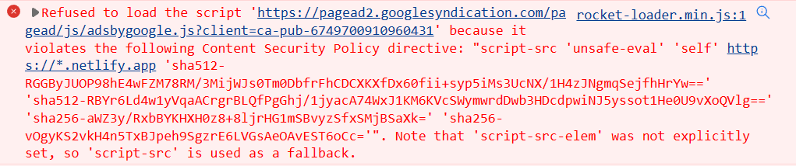
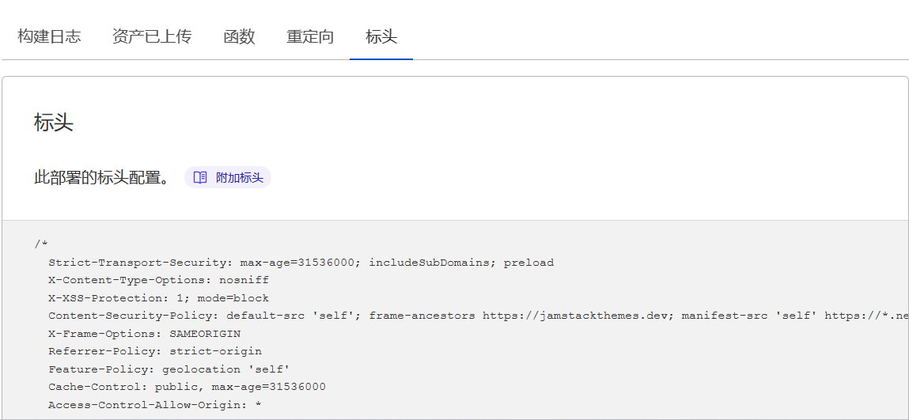
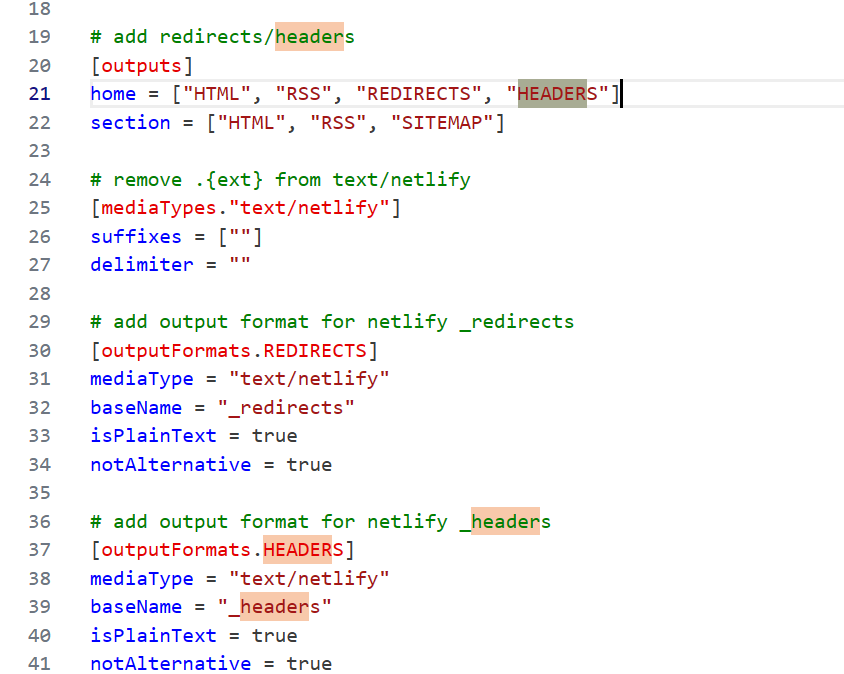
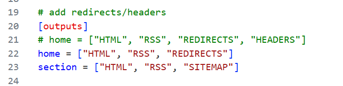
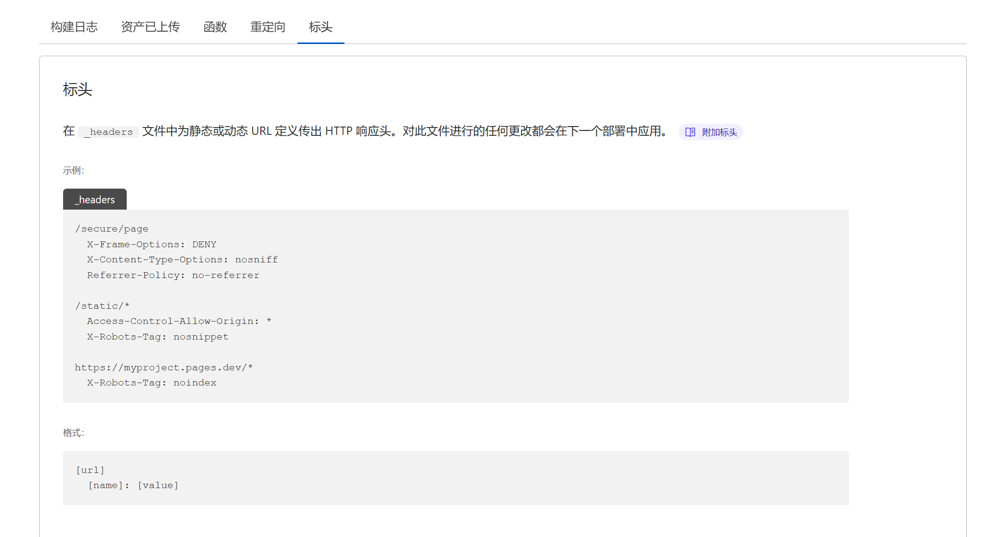

本文主要介绍 Cloudflare Pages 中自定义标头 Headers 功能。以及使用 Headers 处理 Content Security Policy (CSP)

## Introduction

今天发现博客之前用的 Google Analytics 被拦截了。



报错为 `Refused to execute inline script because it violates the following Content Security Policy directive: "script-src 'unsafe-eval' 'self'`。

查了一下这个错是 Header 里设置了 CSP。很奇怪。我本身没有设置这个东西，而且显然我这套部署没有任何与 `netlify.app` 相关的内容。应该是在构建的时候通过相关程序加进来的。总之要试着修复一下。


## Content Security Policy (CSP)

内容安全策略 (CSP) 是一种增加的安全层，可以帮助检测和缓解某些类型的攻击，包括跨站脚本 (XSS) 和数据注入攻击。这些攻击用于从数据窃取、网站篡改到恶意软件分发等各种目的。

>CSP 的实质就是白名单制度，开发者明确告诉客户端，哪些外部资源可以加载和执行，等同于提供白名单。

启用 CSP 可以使用 Content-Security-Policy HTTP 标头，也可以用 `<meta
http-equiv =“Content-Security-Policy” content =“default-src'self'; img-src https://*; child-src 'none';”/>`，当同时使用 <meta> 元素和 HTTP 标头来配置 CSP 时，HTTP 标头的优先级高于 <meta> 元素。

**给定 CSP 后，如果引用来自其他地址的脚本，又没有加入白名单，就会被浏览器拦截。**


## Cloudflare Pages Header

要将标头附加到 Cloudflare Pages 响应，请在项目的输出文件夹中创建一个 _headers 纯文本文件。格式是 `path` 后面缩进写 `headers`。

例如，需要允许跨域 CORS 的话，可以直接这么写：

```
/*
  Access-Control-Allow-Origin: *
```

另外也可以取消某一 `header`，下面就是一个取消 CSP 的例子。

```
/*
  Content-Security-Policy: default-src 'self';

/*.jpg
  ! Content-Security-Policy
```

可以在部署界面查看已经附加的标头。虽然不知道是哪里来的，但是我这里确实是有一个 CSP 标头。




## Disable CSP

简单粗暴的方法就是直接 Disable CSP。也就是删了这个 `_headers`。由于这是一个 Hugo 项目，查看项目的 `config.toml`，发现输出了一个 `Headers` 文件。



直接去掉所有标头输出。



保存提交。可以看到 Cloudflare 里现在已经没有 Header 设置了：



<!-- 清一下缓存，再打开博客页面。Google Analytics 正常加载。 -->

注意：不能直接新建 `_headers`在输出目录下。会被覆写。

## Conclusion

这次由于用的主题比较离谱，给我构建了一个 Header 输出，里面的 CSF 规则直接把外部资源全部拦截了。取消构建输出就 OK。当然这样把其他 Headers 也去掉了。肯定不是最优选项。

## References

1. https://developers.cloudflare.com/pages/platform/headers
2. https://developer.mozilla.org/en-US/docs/Web/HTTP/CSP
3. https://www.ruanyifeng.com/blog/2016/09/csp.html