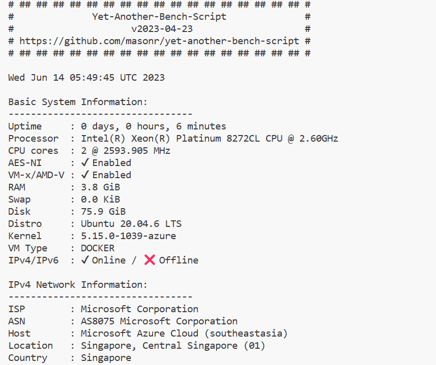
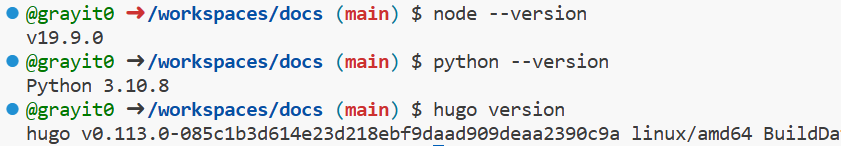
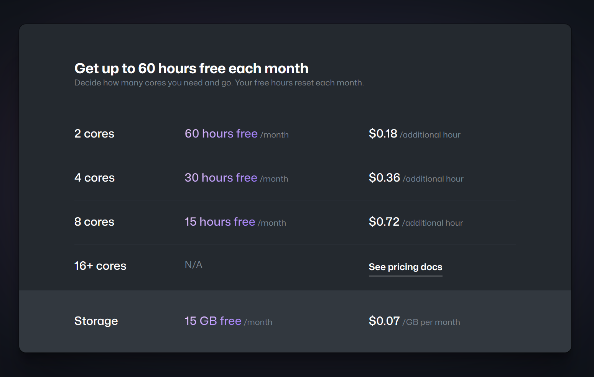
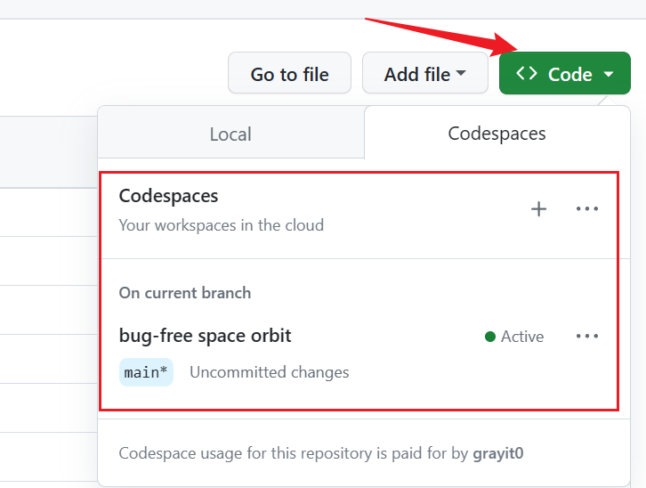
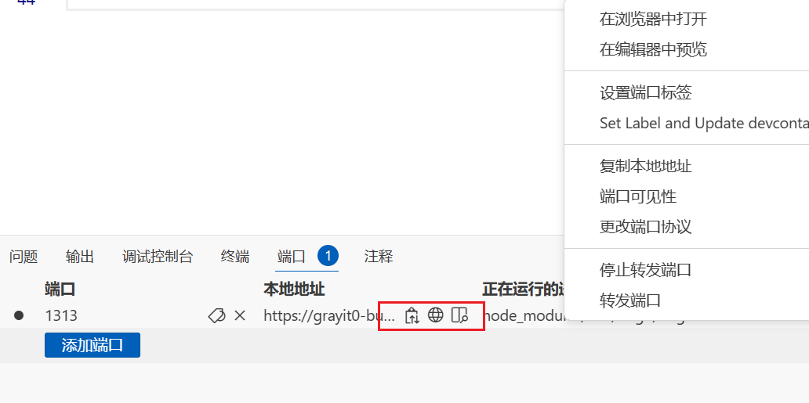

**本文通过 Codespace 编辑**

## Introduction

VSCode 目前已经可以胜任绝大部分工作环境了，而且还可以通过 Remote Tunnel 这种操作把 VPS 一键配置为远端开发平台。但是如果手头没有方便的 VPS 或者仅仅需要简单快速、对单仓库进行修改开发，可以考虑使用 Github 免费提供的 Codespace。

基于 docker 虚拟化的 Codespace 提供了基础 2H4G 的配置，运行在 Azure 上。我这台是新加坡地区。

自带了 node、python 等基础环境，特别是还预装了 Hugo。对于我这种平时就写写 Python，用 Hugo 写博客的人来说是很方便了。

时间上，一个月有 60h 的免费时长。时间虽然不多，但是应急完全够用。不用的时候可以休眠，**数据是自动保留的**。

## How to use Codespace

打开 Codespace 的方法非常简单，进入仓库选择 Open-Codespace，就会自动弹出 Codespace 界面。由于是基于 VSCode 开发的，上手也比较简单。（如果不会用的话去看 VSCode 教程吧）

需要注意的是，一个 Github 账号最多有两个 Codespace（不管是否在运行），不要的 Codespace 可以随手删掉。

Codespace 默认支持图片直接复制，截图在剪贴板之后，只需在 markdown 编辑界面 Ctrl+V 即可完成上传图片到目录、重命名、将图片导入 markdown 的一系列操作。

另外，对于前端开发者/博客主，有一个端口转发功能也值得一提。运行服务之后，Codespace 会自动转发程序入口到 HTTPS 网址上，实现实时预览和展示，这个功能在“端口”栏。此外，默认转发的网址只有自己可见，如果需要分享，可以在项目上右键，改为 Public。

## Conclusion

其实就是在 Github 仓库里点一下。反正不要钱，不用白不用。