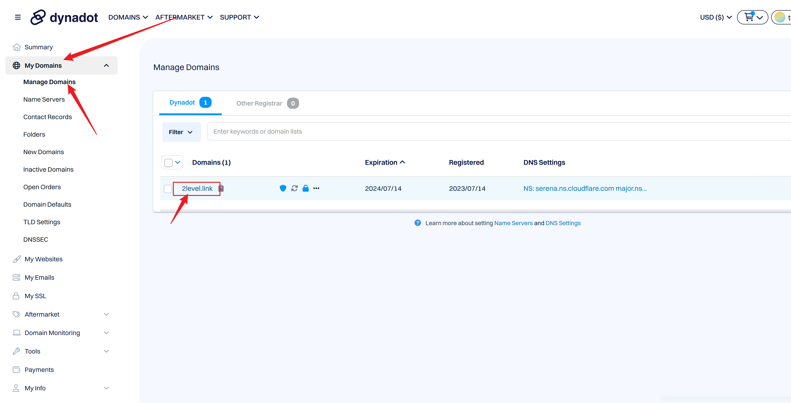
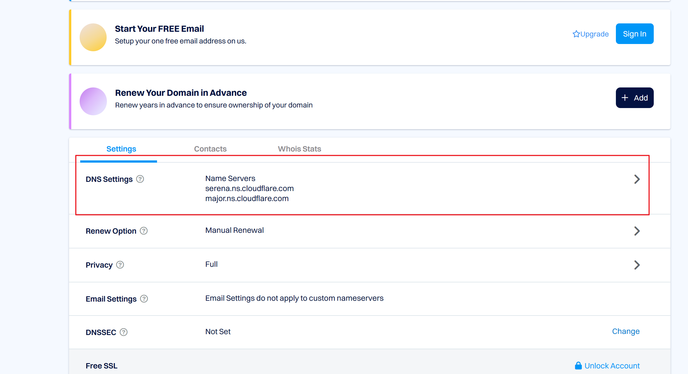
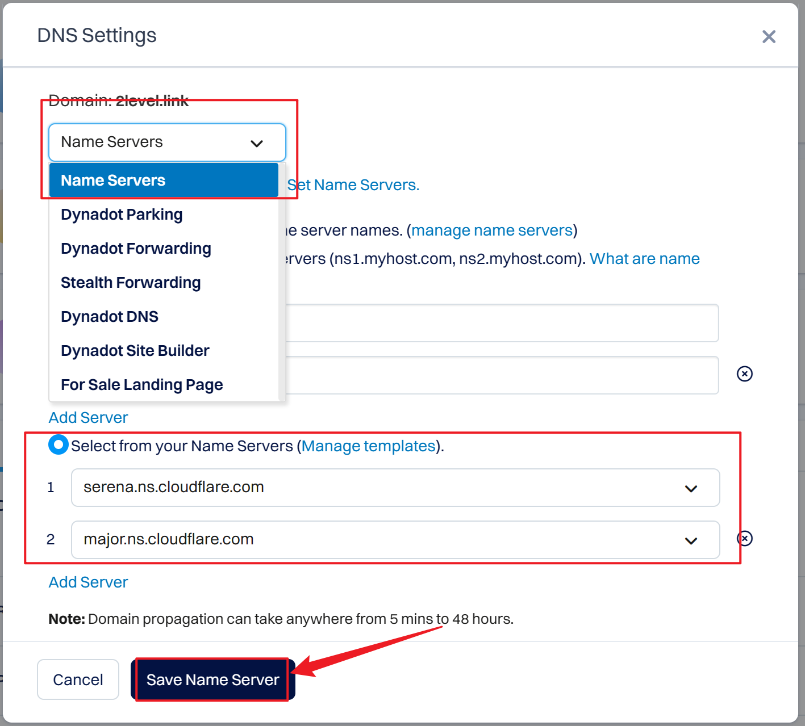

最近 dynadot [开启了一个免费申请 Link 域名的活动](https://www.dynadot.com/register-your-free-link-domain)，相信很多人已经上车了。这里还是发一下以防大家不知道。

已知：
- 免费一年，续费 namesilo 3.99$。
- 存在一定可能性报错 `You have already used this promo code. Please contact customer support for more information.` 这样可能是被风控了，也有可能是封车了。
- 风控可以考虑换IP或者浏览器。实在不行群里找大佬帮忙注册。
- 域名邮箱可以注册。
- 可以撸多个。

申请完成后，到控制面板，如下绑定 Cloudflare Nameservers：

