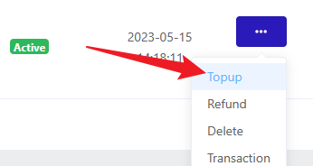
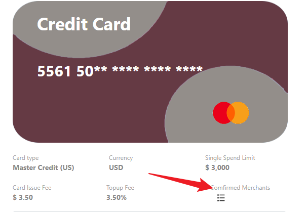

## Introduction

购买云服务经常会遇到不支持银联卡/支付宝等境内支付方案的情况。一种方案是办理外币卡，例如建行宇宙星座信用卡；另外一种方案是使用虚拟卡，例如 Depay 或 Fotoncard。前者通常来说手续费用较低、稳定，但可能出现信息泄露、盗刷的情况。后者虽然手续费较高，但开卡方便、完全匿名支付，在购买小厂家云服务时比较推荐。

然后讲一下 KYC，KYC 全称 "Know Your Consumer"，即客户认证机制。通常来说大部分金融服务会需要本人手持身份证进行验证。虚拟卡也不例外。例如 nobepay 等，均需要实名认证。但由于有个人信息泄露风险，这些平台一般不在我考虑范围之内。

但是，也有部分平台推出了 No KYC 的虚拟卡。全程只需要使用一个邮箱就可以开卡。之前我使用的是 Depay，相应佣金较贵，开卡费 10$。Depay 在近期频繁出现入账失败的情况，在寻找替代品时，我找到了 Fotoncard。

## How to use a Fotoncard

地址： https://dashboard.fotoncard.com/#/pages/register **仅受邀请用户可注册（必填邀请码），可以使用 184671**

Fotoncard 最大优势是免 KYC 支持 USDT 入金。注册完成后，在 Funds 处入金，建议冲 101$，少一点手续费，又不至于太多。这些钱是充入账户余额 (Balance) 的。

然后到 Virtual Card 开卡，选一个合适的卡头 Submit 即可。一般这个时候会要你支付开卡费+初始余额约 35$。

开卡完之后应该会 Issuing 一段时间，然后就可以看到卡了，选择 Topup，把钱从余额划入卡中。之前的初始余额也可以使用

最后，在 Transaction 部分可以看到资金详细流水，考虑到一些商家可能会把验证信息放在流水记录里，这一点 Fotoncard 还是非常便利。

再说说我的感受吧。目前有 6 个卡头 （即规定了卡号前 6 位，后面数字随机，卡头不同，能够注册的服务也不同）。我目前用的是 222929 香港万事达，**支持绑定 Paypal 使用**。可以在面板查询可绑定的商家，避免了开卡后无法使用。

截至目前，开了一张卡成功付款了 300$ 左右，大部分走 PayPal，部分直接走卡，直接走卡可以付款谷歌土耳其，亲测。

开卡费用 2~4$，可多开。部分优质卡头可能限制 1~2 张。杂七杂八手续费加起来可能 4~5%。

## Conclusion

一张无限开的虚拟卡还是很必要的，用来阻止主机商乱扣费。地址 Fotoncard.com，注册不要忘记填邀请码 184671