本篇教程简单介绍一下如何为 Hugo 博客配置 Google Analytics，主要分为两部分：关于 Google Analytic，以及 Hugo 如何配置 head 标签。

## Introduction

Google Analytics 是谷歌下面的一套统计系统，支持网站流量的统计。不收费（但据说用户数据会被用于其他用途），比较稳定（虽然在国内会偶尔出现AP不能访问导致统计数据不全），功能强大。并且据说使用 Google Analytics 会对其他谷歌系的应用有促进作用。因此这里就直接用谷歌。不过您如果希望自建，Matomo 之类的工具也可以。

然后[之前有一篇文章](https://vpslog.net/blog/%E5%80%9F%E5%8A%A9%E4%BA%91%E5%BC%80%E5%8F%91%E5%B9%B3%E5%8F%B0%E5%92%8C%E9%A2%84%E9%85%8D%E7%BD%AE%E7%9A%84%E5%8D%9A%E5%AE%A2%E7%B3%BB%E7%BB%9F%E4%B8%80%E9%94%AE%E6%90%AD%E5%BB%BA%E4%B8%AA%E4%BA%BA%E5%8D%9A%E5%AE%A2-codespace-hugo/)介绍了如何搭建 Hugo，这里就继续按照这个思路，进行配置。

## Get Google Analytics Code

访问 [官网](https://analytics.google.com/analytics/web/provision/#/provision)

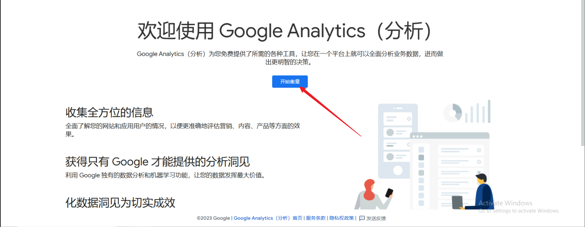

创建一个新账号。谷歌分析具有多级账号控制机制。如果没有特别需求的话，下面全部直接填写你的网站名称即可。

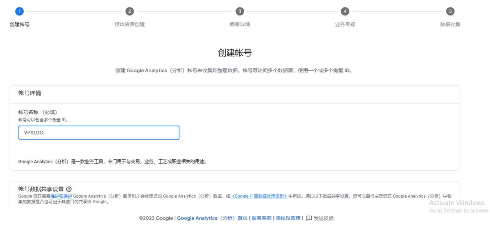

下滑，建议此处全部勾选：

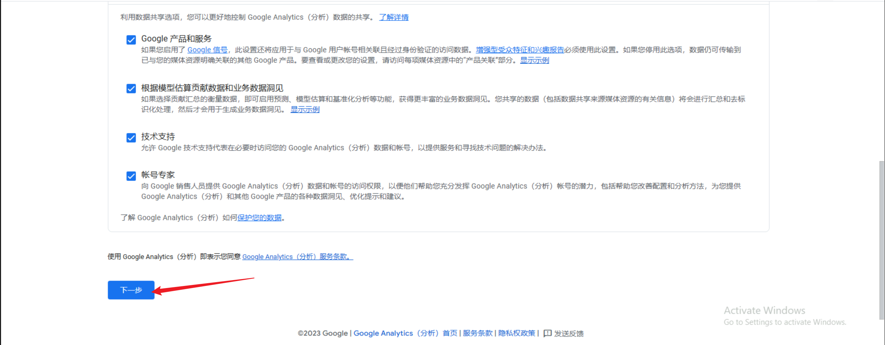

媒体资源也使用网站名。

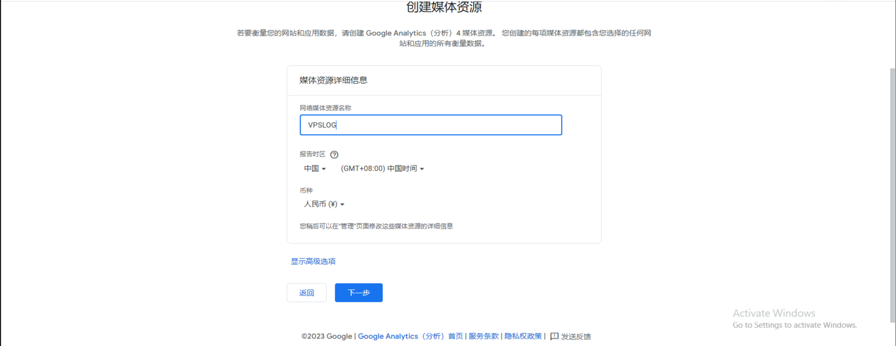

下面两处可以随便填写。也可以按照我这样填写。

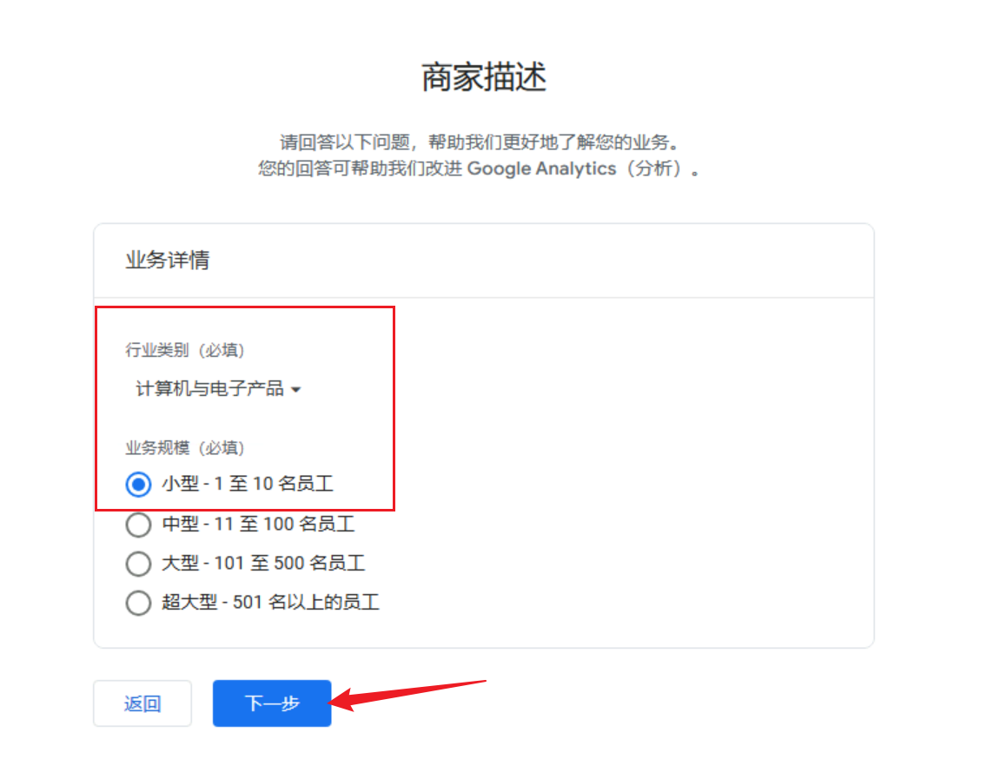

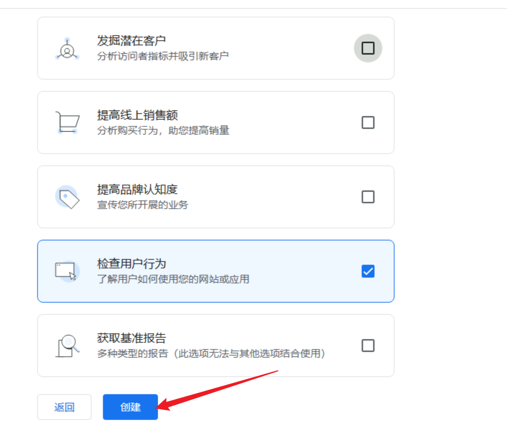

同意条款，下滑还有一个。

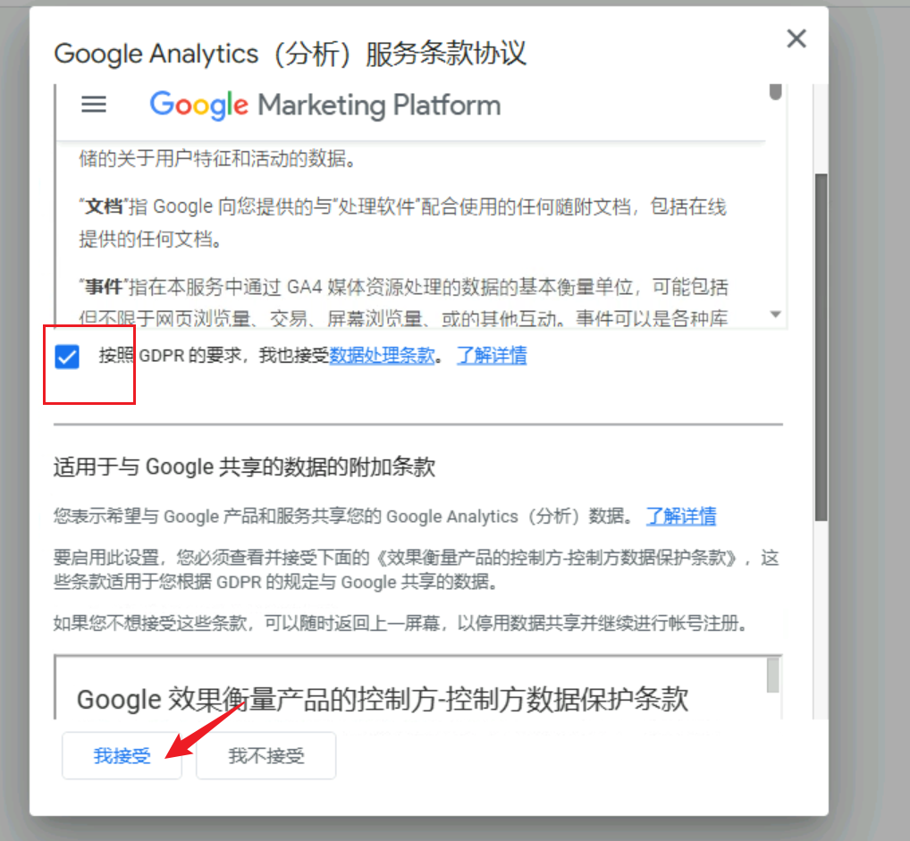

完成后，选择添加网站平台数据。

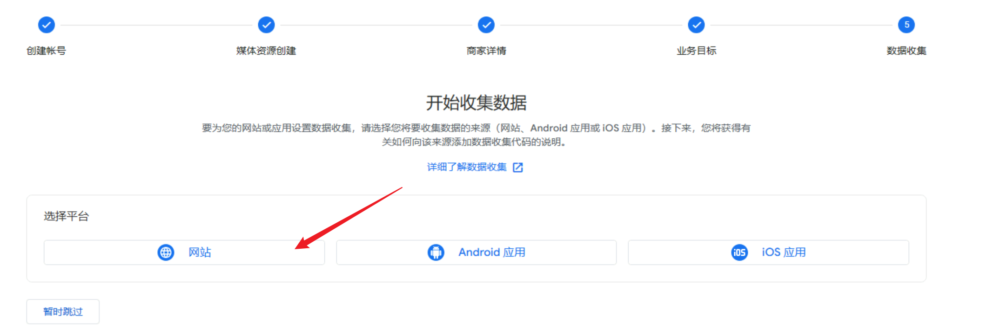

填写**完整的网址**和**网站名称**

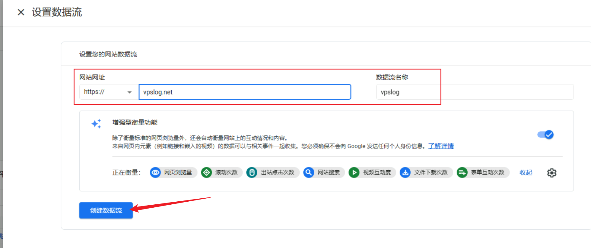

创建之后会跳转到这个界面，选择**查看代码说明**：

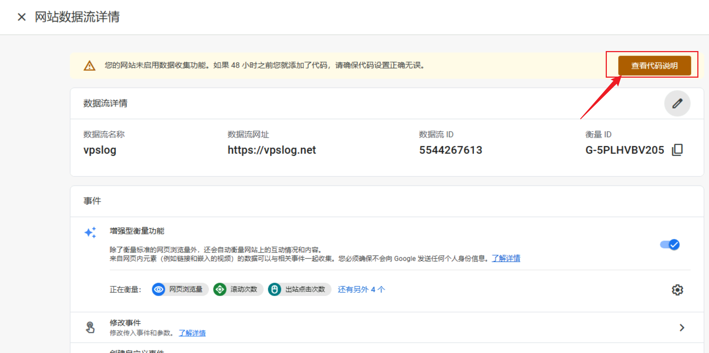

选择**手动添加，复制里面所有代码**

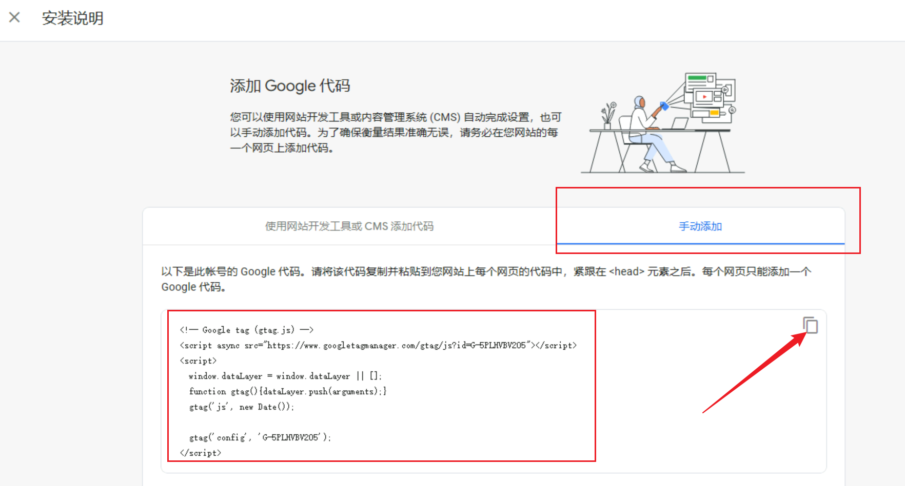

## Insert Analytics Code to \<head\>

首先要知道 Hugo 的渲染模板都在 `layouts` 目录下，这个目录在主题目录以及网站根目录都会出现。而里面一般会有类似 `custom-head.html`或是`head.html`的文件。打开，把所有代码复制在末尾即可。

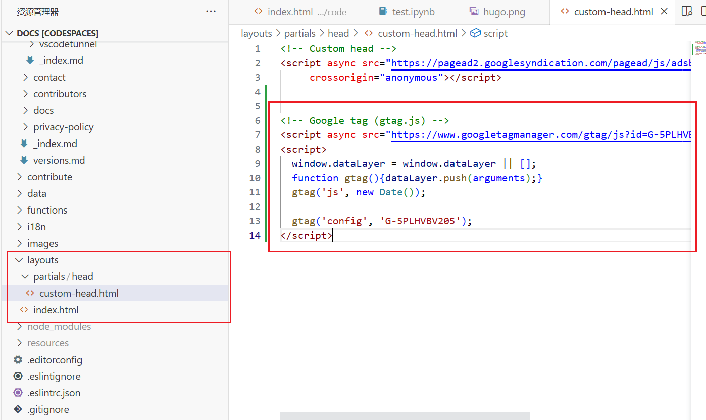

提交之后，过一段时间就可以收到统计数据了。 一开始没有显示是比较正常的。

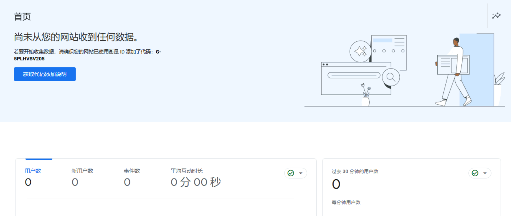

## Conclusion

本文介绍了如何使用 Google Analytics，请注意，由于 Google Analytics 的界面可能变化，因此您的步骤可能与本文略有不同。此外，本文向 Hugo 中添加统计代码的部分也可以用于添加 Adsense 代码。

