本篇教程希望可以零成本、尽量简单地搭建一个支持云端编辑、无需安装额外软件、高可用的静态博客系统。

## Introduction


Hugo 是一款静态博客生成工具。相较著名的 Wordpress 等动态博客系统，静态博客维护简单、SEO 友好、部署成本低（免费）、在线率高，基本不怕 DDOS/CC。在静态博客领域中，Hugo 部署方便、所有功能整合在一个文件中、支持多种主题切换、速度较快。

本文将用 Hugo（博客生成工具）、Codespace（在线编辑器）、Cloudflare Pages（静态网页托管）手把手构建一个博客网页。

## How to deploy

打开 [Github 仓库](https://github.com/i-boke/hugo-blog-start)，选择 Fork：

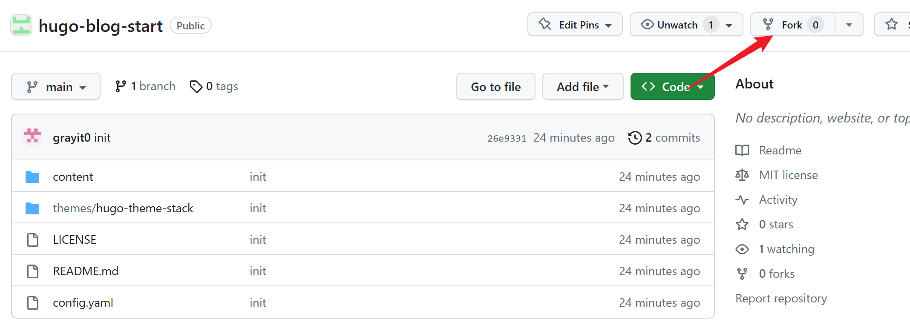

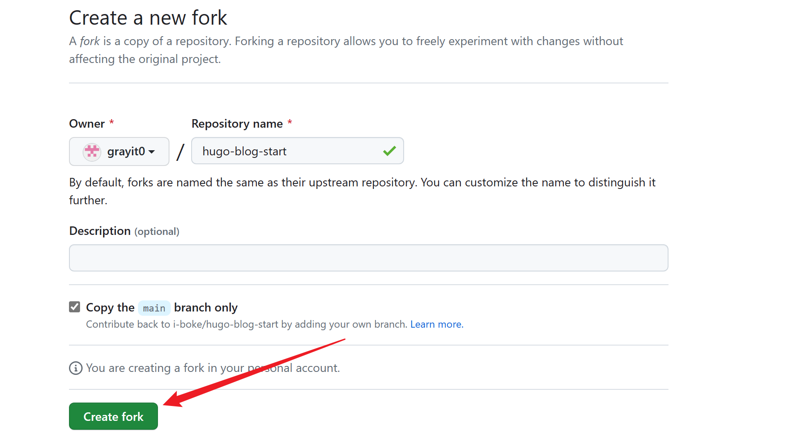

确认之后转到以下界面，**记住仓库名称，复制仓库地址**。

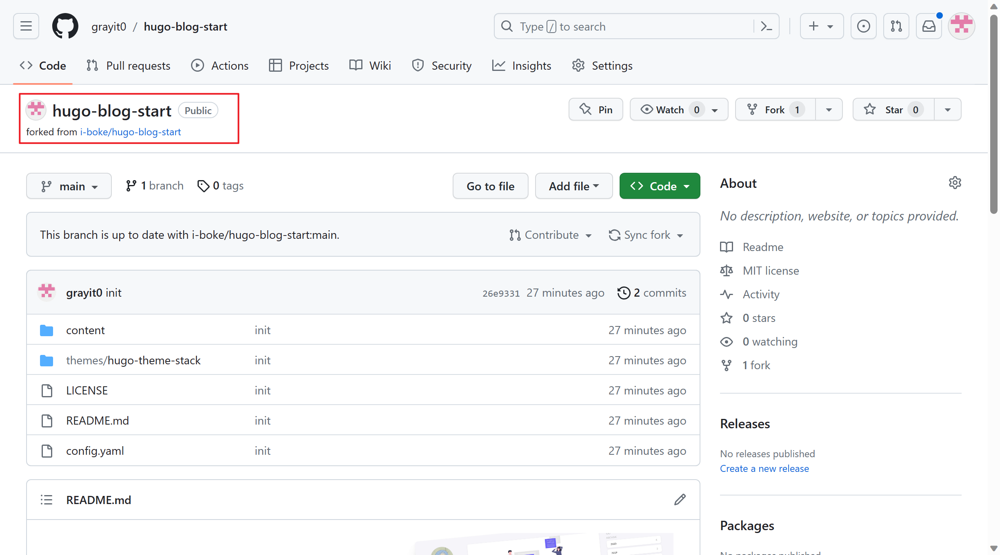

打开 [Cloudflare](https://dash.cloudflare.com/)，选择侧栏 Pages：


创建应用程序，注意创建 Pages 而不是 Workers。

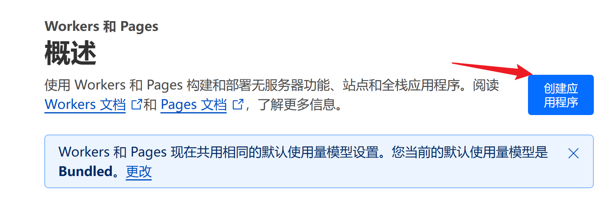

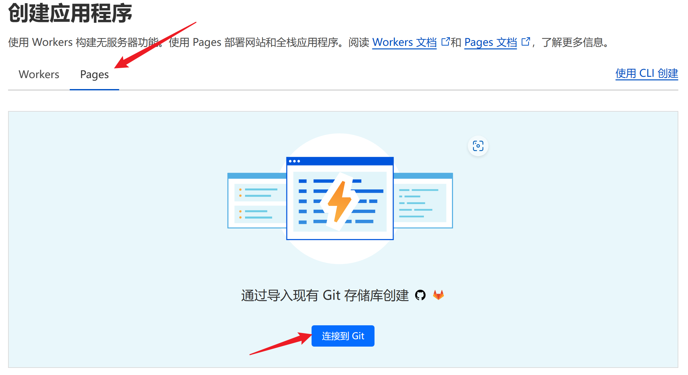


绑定 Github 到 Cloudflare。由于您之前可能没有绑定过账号，这里应该没有任何显示，所以需要添加账户。

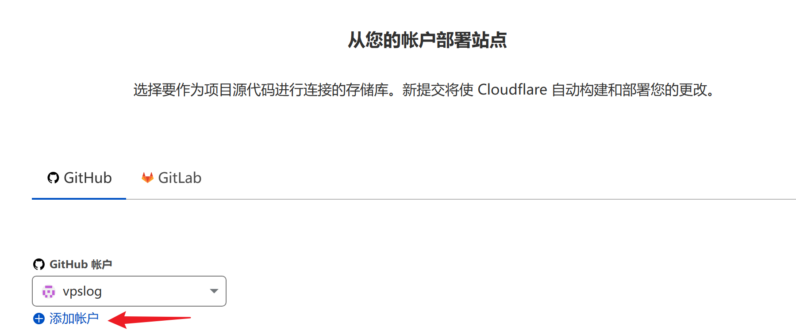

安装到自己的 Github，确认安装：

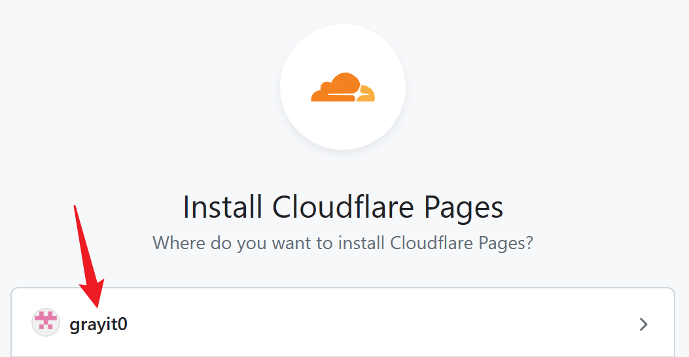

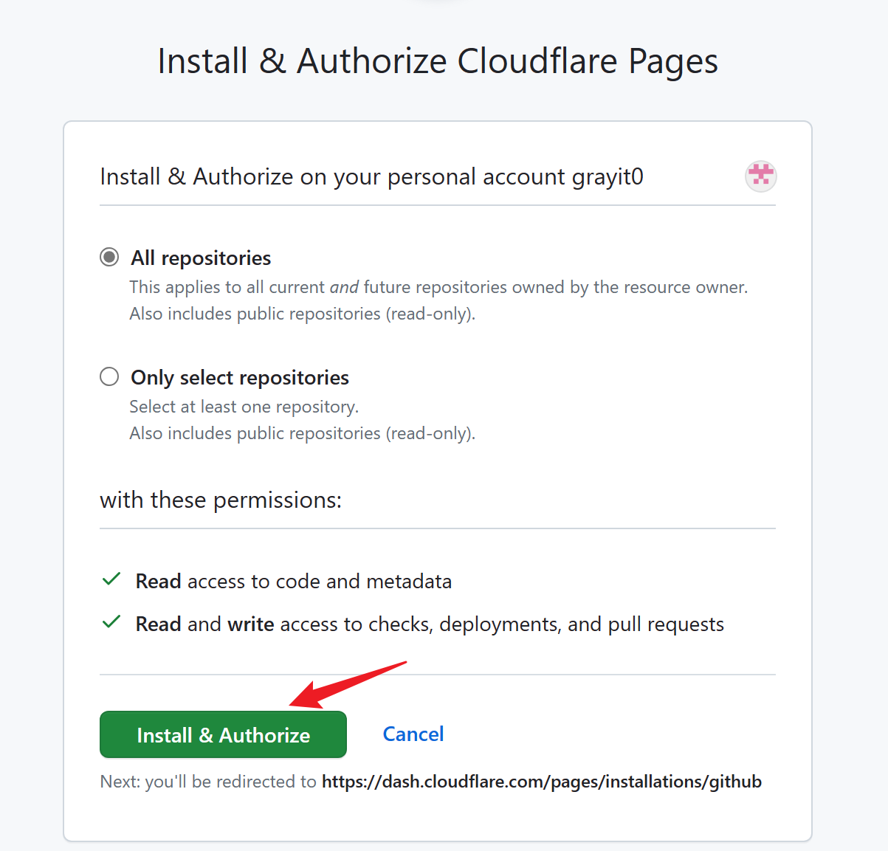

完成之后会自动返回 Cloudflare 界面，选择绑定好的账号，选择刚刚的存储库，进行部署。

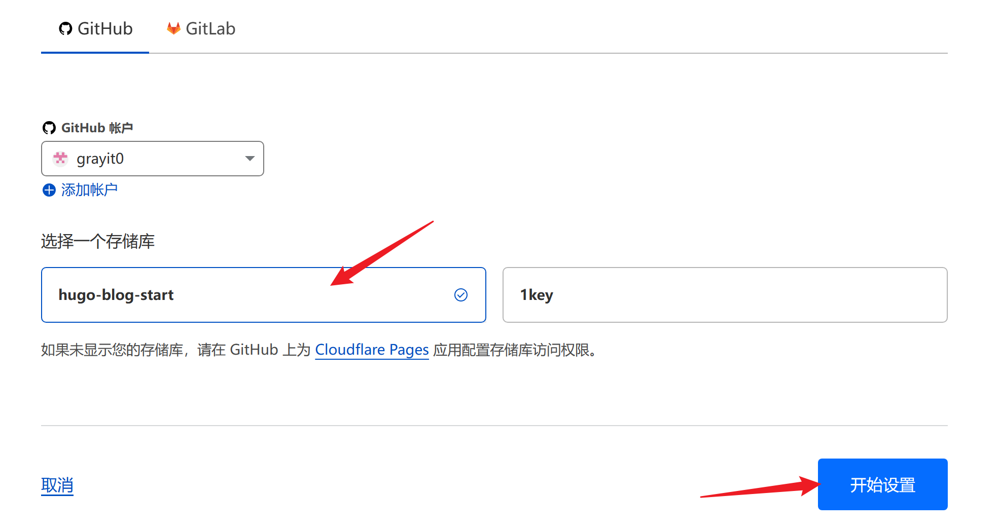

**【重要】** 这一步需要修改默认设置，首先修改框架预设 Hugo，**然后点环境变量，添加一个环境变量`HUGO_VERSION=0.104.0`（设置这一步是因为 Cloudflare 默认 Hugo Version 比较低，部署很容易报错）**。

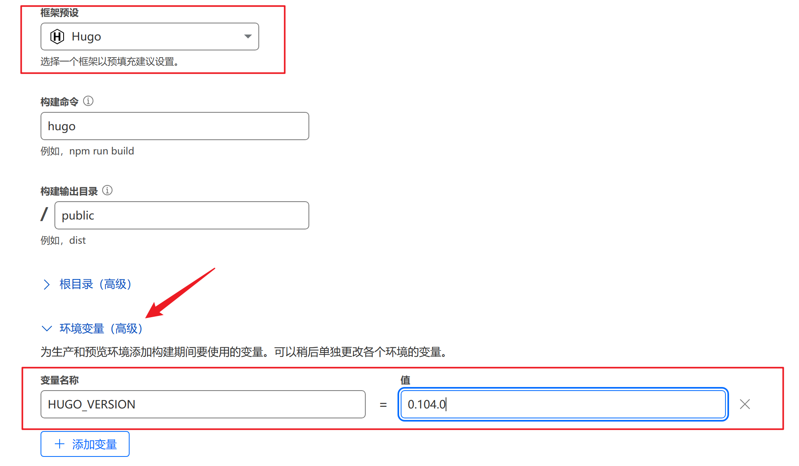

最后点击部署等待完成即可。

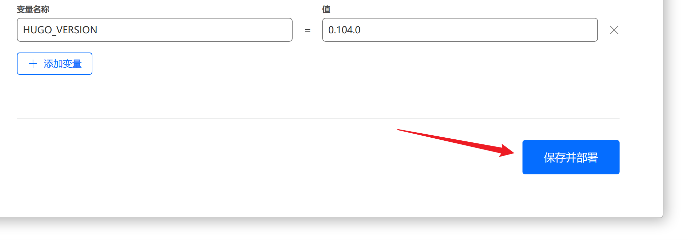

按照流程走，应该是能够成功的。

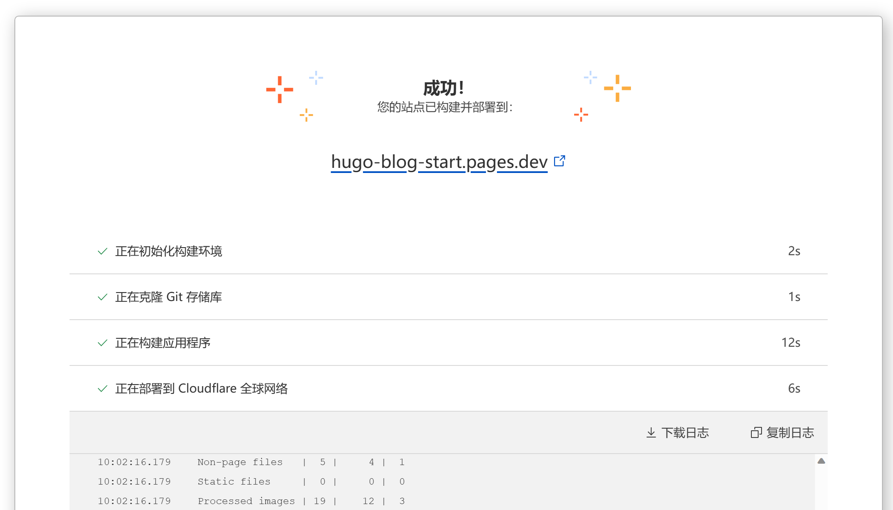

点击蓝色链接，，应该不需要多说了吧。默认效果就是下面这样。

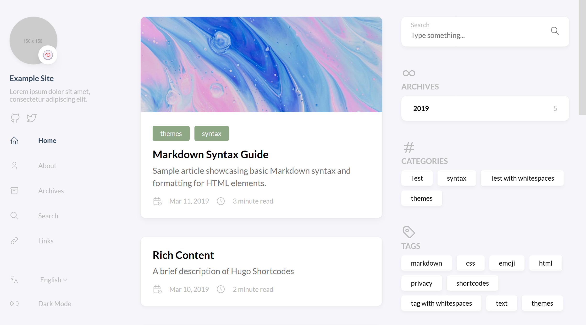

## How to config & create post

**这一部分推荐参考 [官方文档](https://stack.jimmycai.com/guide/getting-started)，以及 [使用 Codespace 一键开启云端编程体验](https://vpslog.net/blog/%E4%BD%BF%E7%94%A8-codespace-%E4%B8%80%E9%94%AE%E5%BC%80%E5%90%AF%E4%BA%91%E7%AB%AF%E7%BC%96%E7%A8%8B%E4%BD%93%E9%AA%8C/)。**

在之前 Fork 得到的仓库里，打开 Codespace。

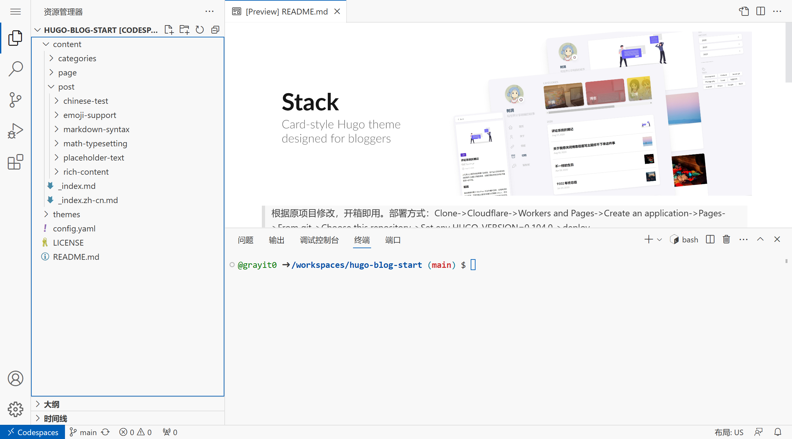

在这些文件中，需要修改的就是两个部分。一个是上面的 `post` 部分，存储所有博客文章。另外一个是下面的 `config.yaml` 部分，用于自定义网页的标题等。

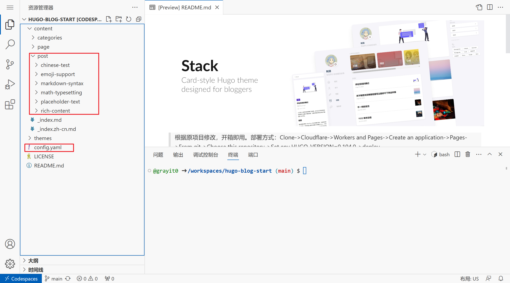

首先修改 `config.yaml`，我的网站所使用的配置如下所示，这里先后给出了无注释、直接粘贴版本和有详细注释的版本。

```yaml
baseurl: https://hugo-blog-start.pages.dev/
languageCode: zh-cn
theme: hugo-theme-stack
paginate: 5
title: Hugo 演示站点

languages:
    zh-cn:
        languageName: 中文
        title: 演示站点
        description: 演示说明
        weight: 2

DefaultContentLanguage: zh-cn

# Set hasCJKLanguage to true if DefaultContentLanguage is in [zh-cn ja ko]
# This will make .Summary and .WordCount behave correctly for CJK languages.
hasCJKLanguage: true

permalinks:
    post: /p/:slug/
    page: /:slug/

params:
    mainSections:
        - post
    featuredImageField: image
    rssFullContent: true

    dateFormat:
        published: Jan 02, 2006
        lastUpdated: Jan 02, 2006 15:04 MST

    sidebar:
        emoji: 🍥
        subtitle: Hugo 演示站点
        avatar:
            enabled: true
            local: true
            src: img/avatar.png

    article:
        math: false
        toc: true
        readingTime: true
        license:
            enabled: true
            default: Licensed under CC BY-NC-SA 4.0

    widgets:
        homepage:
            - type: search
            - type: archives
              params:
                  limit: 5
            - type: categories
              params:
                  limit: 10
            - type: tag-cloud
              params:
                  limit: 10
        page:
            - type: toc

    colorScheme:
        # Display toggle
        toggle: true

        # Available values: auto, light, dark
        default: auto

    imageProcessing:
        cover:
            enabled: true
        content:
            enabled: true

### Custom menu
### See https://docs.stack.jimmycai.com/configuration/custom-menu.html
### To remove about, archive and search page menu item, remove `menu` field from their FrontMatter
menu:
    main: []

    social:
        - identifier: github
          name: GitHub
          url: https://github.com/grayit0
          params:
              icon: brand-github

related:
    includeNewer: true
    threshold: 60
    toLower: false
    indices:
        - name: tags
          weight: 100

        - name: categories
          weight: 200

markup:
    goldmark:
        renderer:
            ## Set to true if you have HTML content inside Markdown
            unsafe: false
    tableOfContents:
        endLevel: 4
        ordered: true
        startLevel: 2
    highlight:
        noClasses: false
        codeFences: true
        guessSyntax: true
        lineNoStart: 1
        lineNos: true
        lineNumbersInTable: true
        tabWidth: 4
```

解释如下：

```yaml
baseurl: https://hugo-blog-start.pages.dev/ #网站域名
languageCode: zh-cn
theme: hugo-theme-stack    # 主题名称
paginate: 5               # 每页文章数
title: Hugo 演示站点      # 网站标题

languages:                # 多语言配置
    zh-cn:
        languageName: 中文
        title: 演示站点
        description: 演示说明
        weight: 2         # 语言权重

DefaultContentLanguage: zh-cn

# 如果DefaultContentLanguage是[zh-cn ja ko]之一，则设置hasCJKLanguage为true
# 这将使CJK语言的.Summary和.WordCount正确工作。
hasCJKLanguage: true

permalinks:
    post: /p/:slug/       # 文章永久链接格式
    page: /:slug/         # 页面永久链接格式

params:                   # 参数配置
    mainSections:
        - post           # 首页展示主要内容类型
    featuredImageField: image
    rssFullContent: true  # 是否在RSS中全文展示内容

    dateFormat:          # 时间格式
        published: Jan 02, 2006
        lastUpdated: Jan 02, 2006 15:04 MST

    sidebar:              # 侧边栏配置
        emoji: 🍥
        subtitle: Hugo 演示站点
        avatar:
            enabled: true
            local: true
            src: img/avatar.png

    article:              # 文章详情页配置
        math: false
        toc: true          # 是否展示目录
        readingTime: true  # 是否展示阅读时间
        license:
            enabled: true
            default: Licensed under CC BY-NC-SA 4.0    # 文章版权声明

    widgets:              # 小工具配置
        homepage:
            - type: search
            - type: archives
              params:
                  limit: 5
            - type: categories
              params:
                  limit: 10
            - type: tag-cloud
              params:
                  limit: 10
        page:
            - type: toc     # 页面目录

    colorScheme:          # 颜色主题
        toggle: true     # 是否开启暗黑模式切换
        default: auto    # 默认颜色主题

    imageProcessing:      # 图片处理配置
        cover:
            enabled: true
        content:
            enabled: true

### 自定义菜单
### 参见 https://docs.stack.jimmycai.com/configuration/custom-menu.html
### 如果要删除“关于”、“归档”和“搜索”页面菜单项，请从其FrontMatter中删除“menu”字段
menu:
    main: []              # 主菜单

    social:               # 社交链接
        - identifier: github
          name: GitHub
          url: https://github.com/grayit0
          params:
              icon: brand-github

related:                 # 相关文章配置
    includeNewer: true    # 是否包含更新的文章
    threshold: 60         # 相似度阈值
    toLower: false        # 是否忽略大小写
    indices:
        - name: tags     # 相关性计算所使用的索引
          weight: 100

        - name: categories
          weight: 200

markup:                  # 标记语言配置
    goldmark:
        renderer:
            ## 如果Markdown中有HTML内容，请将其设置为true
            unsafe: false
    tableOfContents:      # 目录生成器设置
        endLevel: 4
        ordered: true     # 是否使用有序列表
        startLevel: 2
    highlight:            # 代码高亮设置
        noClasses: false
        codeFences: true
        guessSyntax: true
        lineNoStart: 1
        lineNos: true     # 是否显示行号
        lineNumbersInTable: true
        tabWidth: 4
```

然后删掉原来的所有博文，创建一篇新的 hello world。

```sh
# 删除原有博文
rm -r content/post
# 更新 hugo 到 extend 版本
cd /tmp
wget https://github.com/gohugoio/hugo/releases/download/v0.113.0/hugo_extended_0.113.0_Linux-64bit.tar.gz
tar -zxvf hugo_extended_0.113.0_Linux-64bit.tar.gz
chmod +x hugo
cp hugo $(which hugo)
cd /workspaces/hugo-blog-start/
# 创建博文
hugo new post/helloworld/index.md
```

创建完之后随便写点啥。也可以直接贴图进去，注意把 `draft:false` 改成 `draft:true`

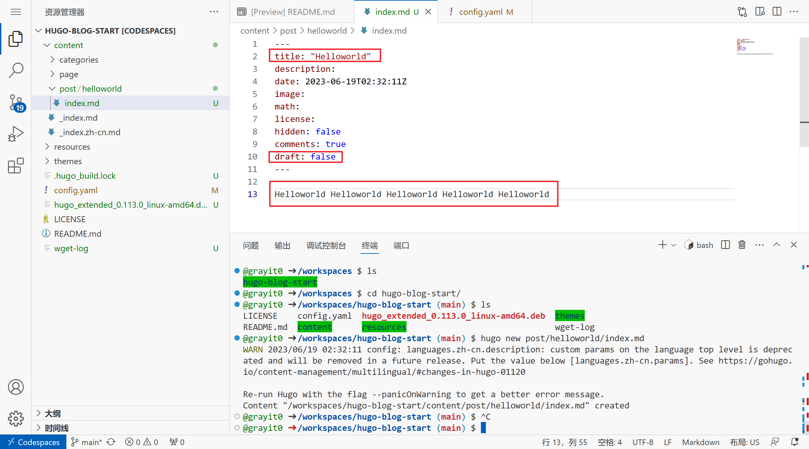

然后左边提交所有更改即可。

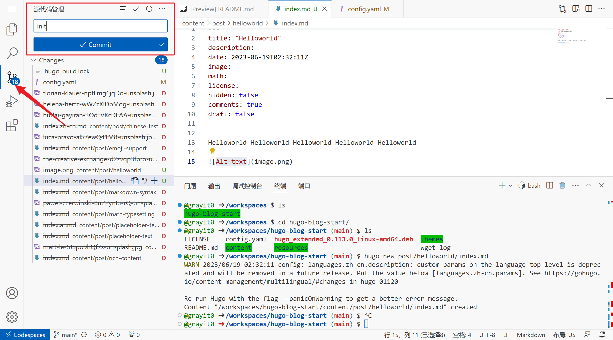

同步更新，会弹几个窗口，确认即可。

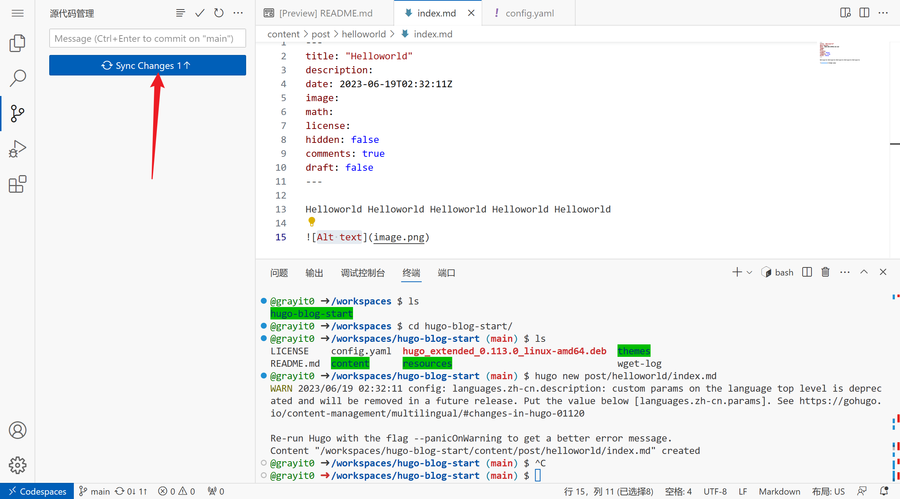

过一段时间，就可以在网页上看到更新了。

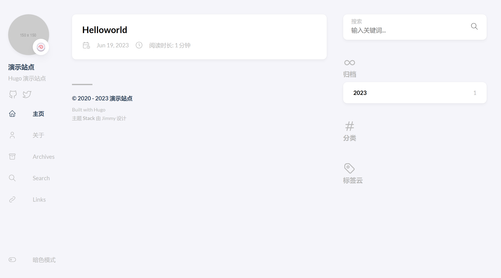


## Conclusion

本文其实牵扯到很多基本工具/平台的使用。包括 Hugo、Git、Bash、Cloudflare、Github、Codespace，也涉及到域名、容器相关的内容。这里仅仅是最简单的使用流程，我们之后也会撰写系列教程进行阐述。