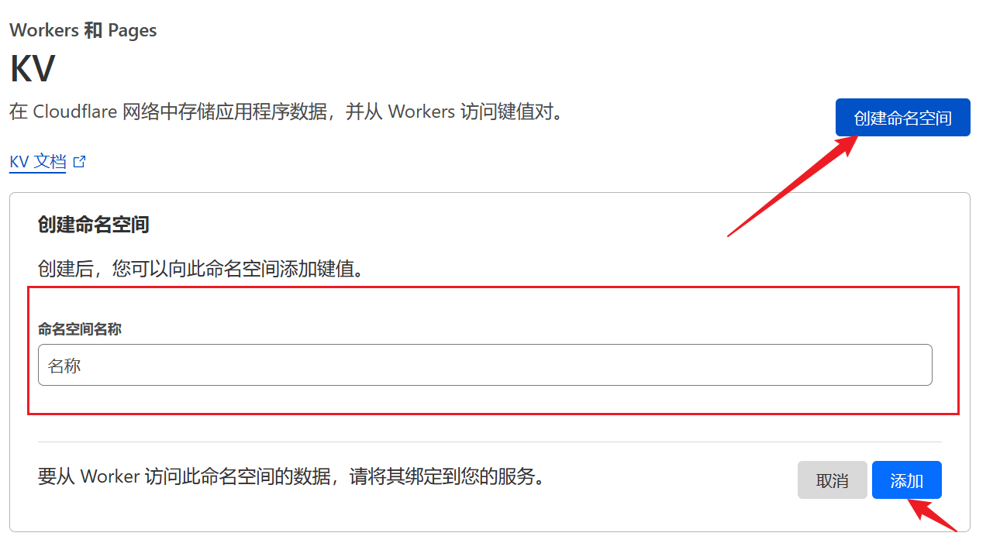
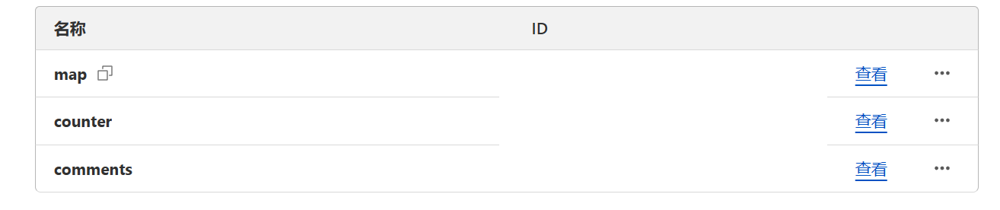
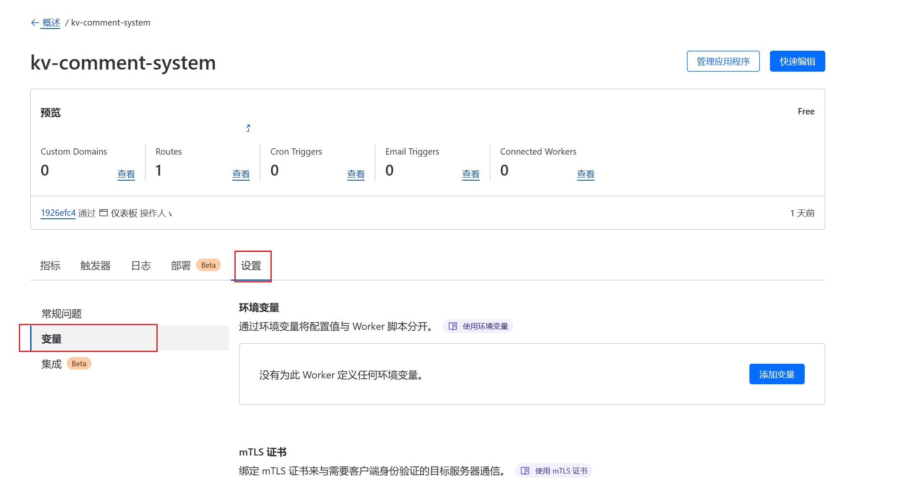
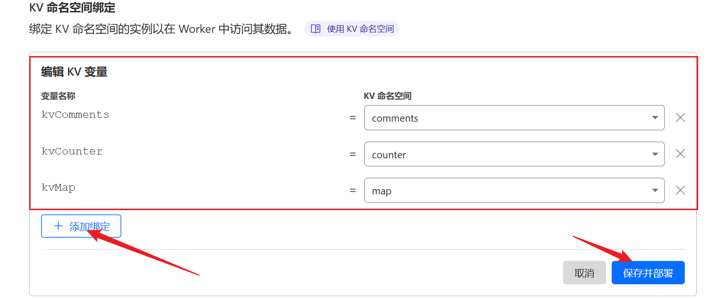
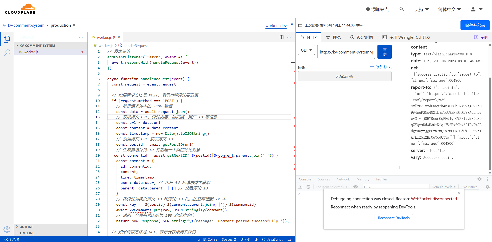

相信大家对 Cloudflare Worker 已经有一定的了解，因此本文将简要介绍 KV 相关内容，并使用 Worker + KV 构建后端。

## Introduction

Cloudflare Worker 作为一个 Serverless 平台已经得到了广泛的应用，但缺乏数据库的互动一直是 Workers 开发的痛点。 Cloudflare KV 的出现解决了这个问题。KV 是一个键值存储数据库，类似 redis。

>Workers KV是一种全球低延迟的键值数据存储。它将数据存储在少量集中式数据中心中，然后在访问后将该数据缓存在 Cloudflare 的数据中心中。可以使用 Cloudflare 仪表板与 KV 交互，**并可在 worker 环境中使用 KV 命名空间**。

官方文档在 [KV 文档](https://developers.cloudflare.com/workers/wrangler/workers-kv/) 和 [worker 交互示例](https://developers.cloudflare.com/workers/runtime-apis/kv)。

价格方面，其实 KV 的免费计划并不算特别充裕，但是跑一个小博客应该绰绰有余。此外， Cloudflare 也有超额度不停机的先例。

|  | Free plan | Paid plan |
| --- | --- | --- |
| Read requests | 100,000 / day | 10 million/month, + $0.50/million |
| Write requests | 1,000 / day | 1 million/month, + $5.00/million |
| Delete requests | 1,000 / day | 1 million/month, + $5.00/million |
| List requests | 1,000 / day | 1 million/month, + $5.00/million |
| Stored data | 1 GB | 1 GB, + $0.50/ GB-month |


## Development

### 准备工作

首先创建 KV。可以直接用仪表盘：




这里创建了 3 个命名空间。



**然后把命名空间绑定到 Worker 上，必须要做这一步，否则 worker 无法访问 KV。**





这样三个命名空间都可以用变量 `KvComment` 等获取了。这些变量是系统给定的。在编辑界面可能会报 warning，但是可以使用。

根据官方文档，总的来说，交互有以下几种方法：

1. 写入键值对 使用 put 方法可以创建新的键值对，或者更新已有键对应的值。使用 Wrangler 或 API，可以一次写入多个键值对。但是当前不支持从Worker中进行批量写入。此外，可以为键设置过期时间，到达指定时间或者一段时间后自动删除。可以在写入键时通过 put 方法的 options 参数进行设置。
    
```
await NAMESPACE.put(key, value);
```

2. 读取键值对 使用 get 方法获取指定键的值。注意 get 方法可能返回旧的值，需要等待最新值缓存到各地数据中心。

```
NAMESPACE.get(key);
```
    
3. 删除键值对 调用任何绑定到脚本的命名空间上的 delete 方法即可删除键值对。该方法返回一个 promise ，需要等待以验证删除成功。
 
```
await NAMESPACE.delete(key);
```

4. 列出所有键值对 使用 list 方法可以查看给定命名空间中存在的所有键。可以使用prefix 参数过滤所有键，使用 limit 参数设置返回的最大数量，使用 cursor 参数进行分页响应。键总是根据其UTF-8字节进行词典排序返回。
    
   1. 按前缀列表显示键 使用 list 方法并带有 prefix 参数，可以列出以特定前缀开头的所有键。可以按照排序规则进行排序，并且如果有更多键需要获取，则可以使用list\_complete和cursor属性进行分页的响应。
         
   2. 分页 如果有更多键需要获取，将设置list\_complete键为false，并同时返回一个游标。在这种情况下，可以再次使用带有cursor值的list方法获取下一批键。注意，在keys中检查空数组不足以确定是否还有更多键可获取；应该检查list\_complete属性。因为最近到期或删除的键必须进行迭代，但不会包括在返回的键中。

```
NAMESPACE.list({prefix?: string, limit?: number, cursor?: string})
```

### 思路

以上列出的四个方法中，只有第四个方法包含了“检索”功能。因此考虑将某一博文下所有评论统一使用一个前缀进行存储。考虑到 URL 可能过长，加一个映射过程（但是可能造成双倍读开销）

检索方式是通过在 KV 存储中使用博文的 ID 构成前缀，然后调用 `kvComments.list()` 方法分页列出所有与该前缀匹配的键值对来获取与博文相关的所有评论。为了能够正确地处理多个博客和评论，使用一个名为 kvMap 的 KV 存储用于将博文 URL 映射到博文 ID 上，并使用一个单独的计数器存储在名为 kvCounter 的 KV 存储中，以生成唯一的自增评论 ID 和博文 ID。

具体而言，当发表新评论时，使用博文 URL 通过 kvMap 获取博文 ID，如果 kvMap 中没有该博文 URL，则会为其生成一个新的博文 ID 并将其映射到该博文 URL 上。。接着，使用 `getNextID()` 函数从 kvCounter 中获取下一个自增评论 ID，并将评论内容、时间戳、用户 ID 等信息与该 ID 一起存储在名为 kvComments 的 KV 存储中，其中键由博文 ID 和评论 ID 组成。当获取博文评论时，处理程序会首先使用博文 URL 从 kvMap 中获取博文 ID，然后使用 `kvComments.list()` 方法按博文 ID 构成前缀分页列出所有与该前缀匹配的键值对，并将每个键值对中存储的评论解析为 JSON 格式后添加到评论数组中，最终返回一个包含所有检索到的评论的 JSON 数组。

考虑回复问题：发表评论时可以指定新评论所回复的父级评论 ID，如果没有指定则默认为一个空数组，表示这条评论是针对博文本身的。在存储评论时，会根据父级评论 ID 构造出一个嵌套结构的键值，并将评论对象存储在该键值下。例如，如果要将一条评论回复某条父级评论，则会以以下形式存储：`postid|parentid1|parentid2|commentid`。获取评论时，会对每个评论进行递归遍历，并根据评论的父级评论 ID 将其添加到相应的 children 数组中，构造出一个评论树形结构。

具体实现如下：

```js
// CORS 前端地址
var FRONT_END_URL='*'

// 发表评论
addEventListener('fetch', event => {
  event.respondWith(handleRequest(event))
})

async function handleRequest(event) {
  const request = event.request
  const headers = new Headers({
    "Access-Control-Allow-Origin": FRONT_END_URL,
    "Access-Control-Allow-Methods": "GET, POST",
    "Access-Control-Allow-Headers": "*",
  })
  // 如果请求方法是 POST，表示有新评论要发表
  if (request.method === 'POST') {
    // 解析请求体中的 JSON 数据
    const data = await request.json()
    console.log(data)
    // 获取博文 URL、评论内容、时间戳、用户 ID 等信息
    const url = data.url
    const content = data.content
    const timestamp = new Date().toISOString()
    // 根据博文 URL 获取博文 ID
    const postid = await getPostID(url)
    // 生成自增评论 ID 并创建一个新的评论对象
    const comment = {
      content,
      time: timestamp,
      user: data.user, // 用户 id 从请求体中获取
    }
    // 将评论对象以博文 ID 和评论 ID 构成的键存储到 KV 中
    const prefix = data.parent && data.parent.length ? `${postid}|${data.parent}` : `${postid}`
    const key = `${prefix}|${await getNextID(prefix)}`
    await kvComments.put(key, JSON.stringify(comment))
    // 返回一个带有状态码为 200 的成功响应
    return new Response(JSON.stringify({ message: `Comment posted successfully. ID = ${key.split("|").slice(1).join('|')}` }), { status: 200 ,headers})

    // 如果请求方法是 GET，表示要获取博文评论
  } else if (request.method === 'GET') {
    // 从查询参数中获取博文 URL
    const url = new URL(request.url)
    const postUrl = url.searchParams.get('url')
    // 根据博文 URL 获取博文 ID，并检索与该博文相关的所有评论
    const comments = await getComments(postUrl)
    // 返回一个带有状态码为 200 的响应，其中包含所有检索到的评论
    return new Response(JSON.stringify(comments), { status: 200 ,headers })

    // 如果请求方法不是 POST 或 GET，则返回一个“无效请求方法”的错误响应
  } else if (request.method === 'OPTIONS') {
    // 添加 Access-Control-Allow-Methods 和 Access-Control-Allow-Headers
    headers.set('Access-Control-Allow-Methods', 'GET, POST');
    // 返回一个空的响应和带有 CORS 相关头信息的状态码 200
    return new Response(null, { status: 200, headers });
  } else {
    return new Response('Invalid request method.', { status: 405 ,headers })
  }
}

function compareKeys(key1, key2) {
  const keys1 = key1.split('|')
  const keys2 = key2.split('|')

  let i = 0
  while (i < Math.min(keys1.length, keys2.length)) {
    // 比较两个键名中第 i 个数字的大小
    if (parseInt(keys1[i]) < parseInt(keys2[i])) {
      return -1
    } else if (parseInt(keys1[i]) > parseInt(keys2[i])) {
      return 1
    }
    i++
  }

  // 如果前面相同长度的部分都相等，则按照长度升序排列
  if (keys1.length < keys2.length) {
    return -1
  } else if (keys1.length > keys2.length) {
    return 1
  }

  // 如果两个键名完全相等，则认为它们相等
  return 0
}


// 获取评论
async function getComments(postUrl) {
  // 根据博文 URL 获取博文 ID
  const postid = await getPostID(postUrl)
  // 构建一个空评论数组，准备存储检索到的评论
  const comments = []
  let cursor = ''
  // 循环列出与博文 ID 相关的所有评论，直到全部检索完毕
  do {
    // 每次列出 1000 条评论，并指定返回的键以博文 ID 和评论 ID 构成的前缀为 prefix
    const { keys, list_complete } = await kvComments.list({
      prefix: `${postid}|`,
      cursor,
      limit: 1000
    })
    // const keys = 
    console.log(keys.map(key => key.name).sort(compareKeys))
    // 遍历每个键，将其对应的值解析为 JSON 格式后添加到评论数组中
    for (const key of keys.map(key => key.name).sort(compareKeys)) {
      let comment = JSON.parse(await kvComments.get(key))
      comment['key'] = key.split("|").slice(1).join('|')
      comments.push(comment)
    }
    // 设置下一页的游标 cursor，如果已经达到最后一页，则设置 cursor 为 null
    cursor = list_complete ? null : keys[keys.length - 1].name
  } while (cursor)
  // 返回所有检索到的评论数组
  return comments
}

// 获取下一个自增 id
async function getNextID(key) {
  // 从 KV 存储中获取指定键名的 id 值
  const id = await kvCounter.get(key)
  // 如果不存在该键，则将其初始化为 1，并返回 '1' 作为第一个自增 id
  if (id === null) {
    await kvCounter.put(key, '1')
    return '1'
  }
  // 将当前 id 转换为整数，加 1 得到下一个自增 id，然后更新 KV 中的值
  const nextId = parseInt(id) + 1
  await kvCounter.put(key, nextId.toString())
  return nextId.toString()
}

// 获取博文的 postid
async function getPostID(url) {
  // 根据博文 URL 从 KV 的映射表 kvMap 中获取博文 ID
  let postid = await kvMap.get(url)
  // 如果该博文 URL 没有对应的博文 ID，则生成一个新的博文 ID，并将其与该博文 URL 映射起来
  if (postid === null) {
    postid = await getNextID('postid')
    await kvMap.put(url, postid)
  }
  // 返回博文 ID
  return postid
}
```





贴近 Worker 部署即可。

## Usage (API Reference)

### 发布评论

#### 请求

- 方法：`POST`
- 请求头：
    - `Content-Type: application/json`
- 请求体（JSON）：
    - `url`：要评论的文章的 URL。
    - `content`：评论内容。
    - `user`：评论人。
    - `parent`（可选）：父级评论的 ID，如果该评论是回复其他评论的，则填写该字段。

示例：

```json
{
  "url": "https://example.com/posts/1",
  "content": "这是一条评论",
  "user": "user123",
  "parent": "15|5"
}``` 

#### 响应

- 状态码：`200`
- 响应体（JSON）：
    - `message`：发布评论成功后返回的消息，其中包含新评论的 ID。

示例：


```json
{
  "message": "Comment posted successfully. ID = 15|5|1"
}
```

### 获取评论列表

#### 请求

- 方法：`GET`
- 查询参数：
    - `url`：要获取评论的文章的 URL。

示例：

`https://kv-comment-system.vpslog-a38.workers.dev/?url=https://example.com/posts/1` 

#### 响应

- 状态码：`200`
- 响应体（JSON 数组）：
    - `content`：评论内容。
    - `time`：评论时间，采用 ISO 8601 格式。
    - `user`：评论人。
    - `key`：评论的 ID。

示例：


```json
[
  {
    "content": "这是一条评论",
    "time": "2023-06-21T08:39:33.747Z",
    "user": "user123",
    "key": "14"
  },
  {
    "content": "这是一条评论",
    "time": "2023-06-21T08:40:26.493Z",
    "user": "user123",
    "key": "15"
  },
  {
    "content": "这是一条评论",
    "time": "2023-06-21T08:41:10.868Z",
    "user": "user123",
    "key": "15|1"
  },
  {
    "content": "这是一条评论",
    "time": "2023-06-21T08:42:58.501Z",
    "user": "user123",
    "key": "15|2"
  },
  {
    "content": "这是一条评论",
    "time": "2023-06-21T08:43:15.987Z",
    "user": "user123",
    "key": "15|3"
  },
]
```


## Conclusion

这样写其实 BUG 挺多的，比如没有考虑到刷评论的情况，另外用户信息也不明确，之后再加吧。