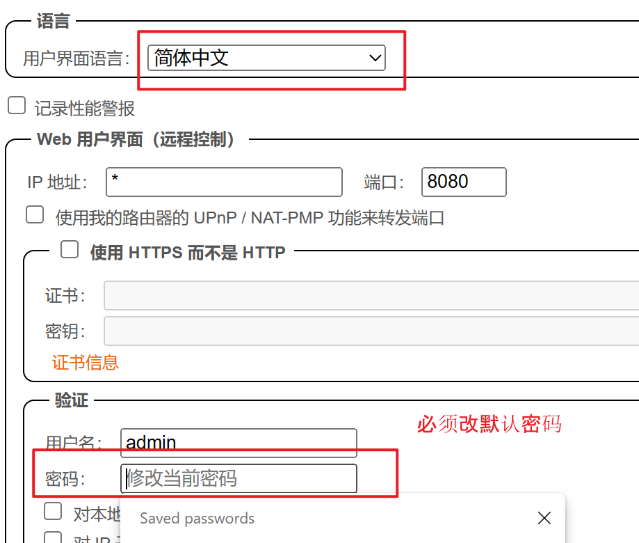
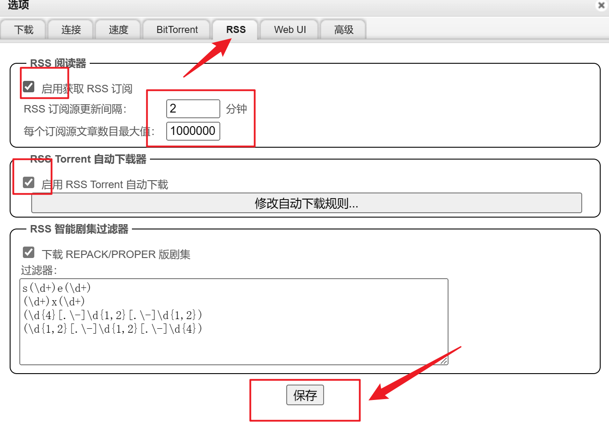
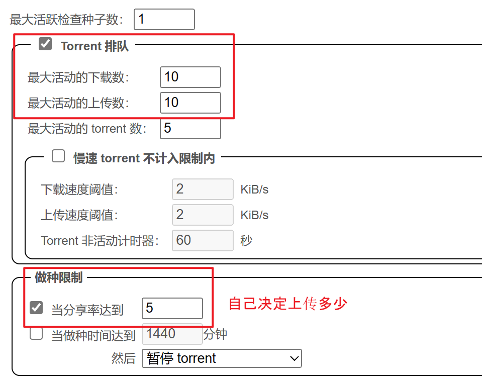

最近购入了一些 4T 硬盘无限流量的大盘鸡，最近又没有什么好项目，就先拿着跑一个影音服务器。

暂定计划是 qbit+alist+emby。之后再看能不能加其他的。

到手的服务器可能没有挂载好硬盘，这里演示一下怎么弄。

## 基础准备

```
fdisk -l
df -a
mkfs.ext4 /dev/vda
mkdir /data
mount /dev/vda /data
```

## qbit

```
docker run -d --name=qbittorrent -e WEBUI_PORT=8080 -p 8080:8080 -p 6881:6881 -p 6881:6881/udp   -v /data:/downloads lscr.io/linuxserver/qbittorrent:latest
```

默认账号 admin 密码 adminadmin









## alist

``` 
docker run -d --restart=always -v /etc/alist:/opt/alist/data  -v /data:/share -p 5244:5244 --name="alist" xhofe/alist:latest
docker logs alist
```


```
docker run -d  --name embyserver  -v /data:/mnt/share -p 8096:8096  -p 8920:8920  emby/embyserver:latest
```
