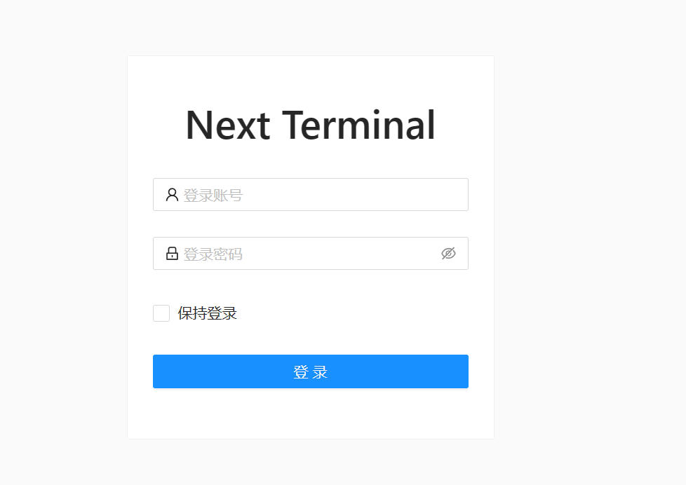
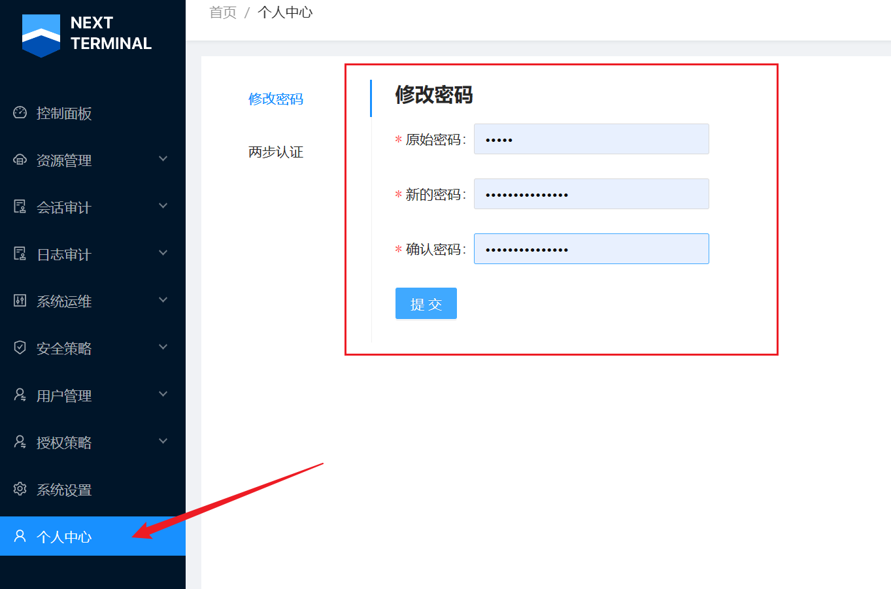
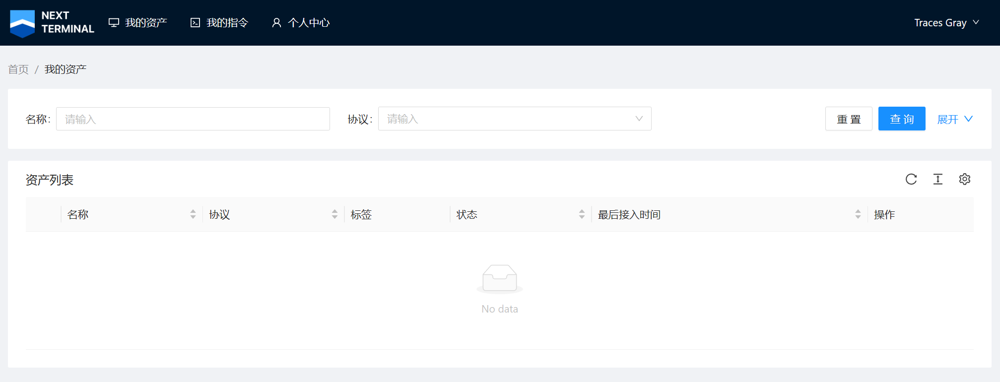
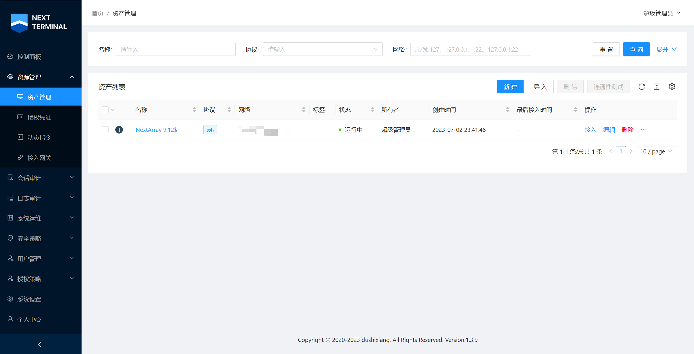
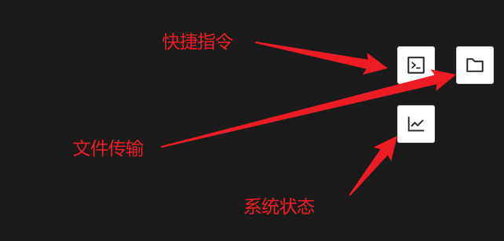
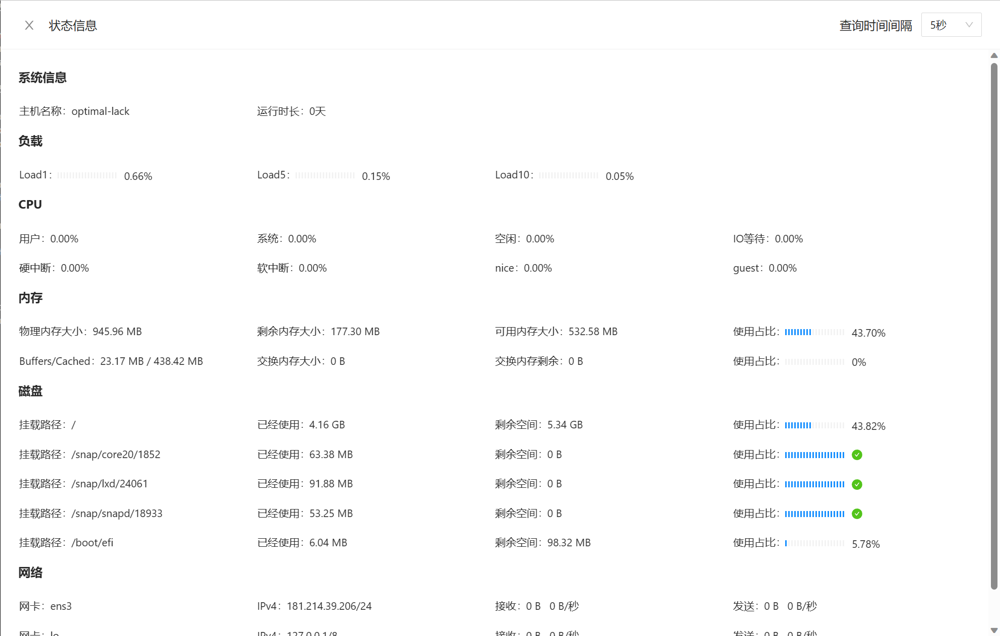
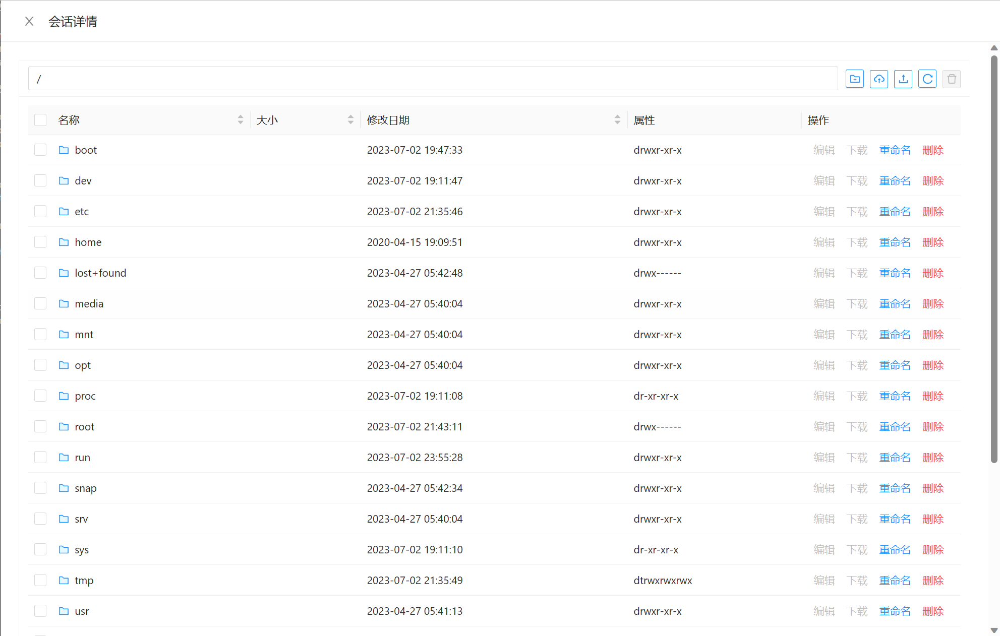

## Introduction

连接自己的云服务器有很多种方式，最简单的，可以直接在 Windows Terminal 中使用 `ssh` 命令连接，也有人偏爱 Termius 等第三方工具。之前我曾使用过 Termius，特别喜欢它的多端同步功能（因为我有多个设备需要使用），但是后来 Github 学生优惠过期，购买 Termius 的价格又太贵（这个定价是真的离谱），其他桌面软件又不太符合我的预期。后来调研到“跳板机”或者说“堡垒机”这一实现方式。即专门用一台机器提供 Webssh，高端一点的还有审计和批量执行功能，例如 Jumpserver 和本文所要介绍的 NextTerminal。

相较桌面软件，专门的“堡垒机”有以下优势：

- 无需安装额外客户端，自带配置信息同步功能。
- 可以直接连接一些本地因为网络原因不能连接的服务器（仅IPV6/国内无法访问等）。
- 协作功能，可以将某些机器划给其他用户使用。
- 与协作功能相对应的审计功能，所有操作都会被记录，可以追踪入侵等。

在各种堡垒机中，JumpSever 算是名气最大的，但是同时对配置的要求也非常高，基本要 4H8G 往上走才能跑得流畅，而且 JumpServer 主要是面向企业，其中的权限划分有些过于繁琐。NextTerminal 是另外一个更加轻量、简洁的开源堡垒机，目前作者也有在持续更新，支持 Docker 一键部署，并且在小机器上也能跑动。


## Deploy

可以参考[官方文档](https://next-terminal.typesafe.cn/docs/install/docker-install.html#%E4%BD%BF%E7%94%A8-sqlite-%E5%AD%98%E5%82%A8%E6%95%B0%E6%8D%AE)

也可以下面脚本直接跑（Ubuntu/Debian）


```bash
# 首先装 docker 和 docker-compose
curl -sSL https://get.docker.com/ | sh
apt  install docker-compose -y
# 创建文件夹并写入 docker-compose.yml 文件
mkdir next-terminal && cd next-terminal

cat <<EOF > docker-compose.yml
version: '3.3'
services:
  guacd:
    image: dushixiang/guacd:latest
    volumes:
      - ./data:/usr/local/next-terminal/data
    restart: always
  next-terminal:
    image: dushixiang/next-terminal:latest
    environment:
      DB: sqlite
      GUACD_HOSTNAME: guacd
      GUACD_PORT: 4822
    ports:
      - "8088:8088"
    volumes:
      - /etc/localtime:/etc/localtime
      - ./data:/usr/local/next-terminal/data
    restart: always
EOF

docker-compose up -d
``` 

这段脚本首先使用 `curl` 命令安装 Docker。然后创建一个名为 `next-terminal` 的文件夹，并在该文件夹内创建一个名为 `docker-compose.yml` 的文件，内容包含了 Docker Compose 的配置。最后，使用 `docker-compose up -d` 命令启动 Docker 容器。

默认跑在 `IP:8088`，然后开个反向代理，开个 HTTPS 就 OK 了。



默认密码 admin/admin。



改一个密码。

## Showcase


普通用户界面



超级管理员界面



除了 Webssh 外，还有一些常用功能。



查看状态信息



上传/下载文件



## Conclusion

本文介绍了 NextTerminal 这个便捷强大的 WebSSH 终端，虽然这个方案不一定是最安全的，但应该是最适合个人/小团队使用的。

