手头有个闲置的谷歌企业版订阅（据称网盘容量无限），家里有个 NAS，最近又入了一台 10Gbps 不限流量 VPS，很自然的想要把 NAS 的东西弄个备份，也方便进行分享。技术上比较好用的就是 Rclone 了。支持的平台也特别多。


## Introduction

Rclone 是一款开源软件，用于管理本地存储、Webdav、S3、以及各种网盘中的文件。提供了复制、同步等功能，以及喜闻乐见的挂载为本地硬盘的功能（当然本文用不到挂载），Rclone 本身是命令行的，但是有开放 API，也有第三方的 GUI。个人推荐还是用命令行，参考 [官方文档](https://rclone.org/)，用起来比较方便。

## Config Rclone

首先安装 Rclone，在 Linux 上一行命令就可以搞定了：

```bash
sudo -v ; curl https://rclone.org/install.sh | sudo bash
```

在 Windows 上的话，得首先去 [下载界面](https://rclone.org/downloads/) 下载 rclone 文件，解压，把里面 rclone.exe 弄出来，然后同目录下 SHIFT+右键，在此处运行 Powershell，然后 `./rclone` 即可。


接下来看按照需要连接的对象，分为不同的选项。

1. 对于可以 ssh 的 VPS，建议直接用 SFTP，不要额外装软件
2. 装了 Webdav，建议 webdav
3. 云盘，选对应选项即可。

### SFTP

>SFTP（Secure File Transfer Protocol）是一种安全的文件传输协议，可以用于在计算机之间传输文件。SFTP并不是FTP的加强版。事实上，它完全不同于FTP。SFTP使用SSH协议进行数据传输，并且所有的数据都被加密，包括用户身份验证信息和文件传输数据。SFTP使用SSH带来了更高的安全性，因为SSH协议本身就提供了一定的安全保障。

以下是流程截图：

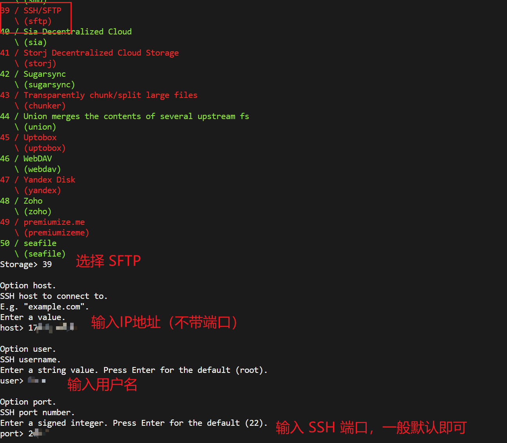

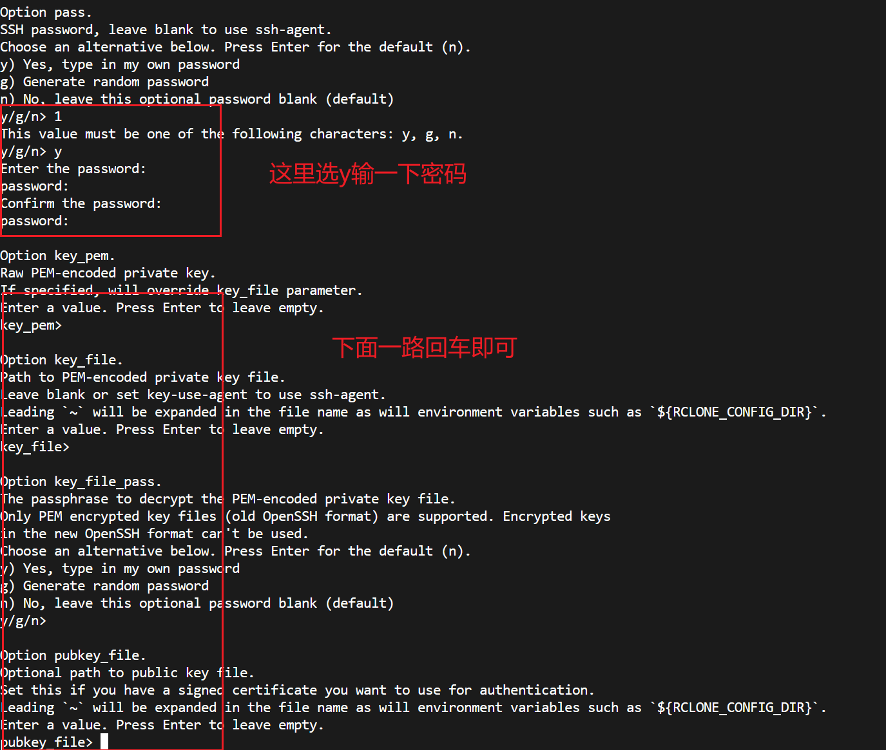

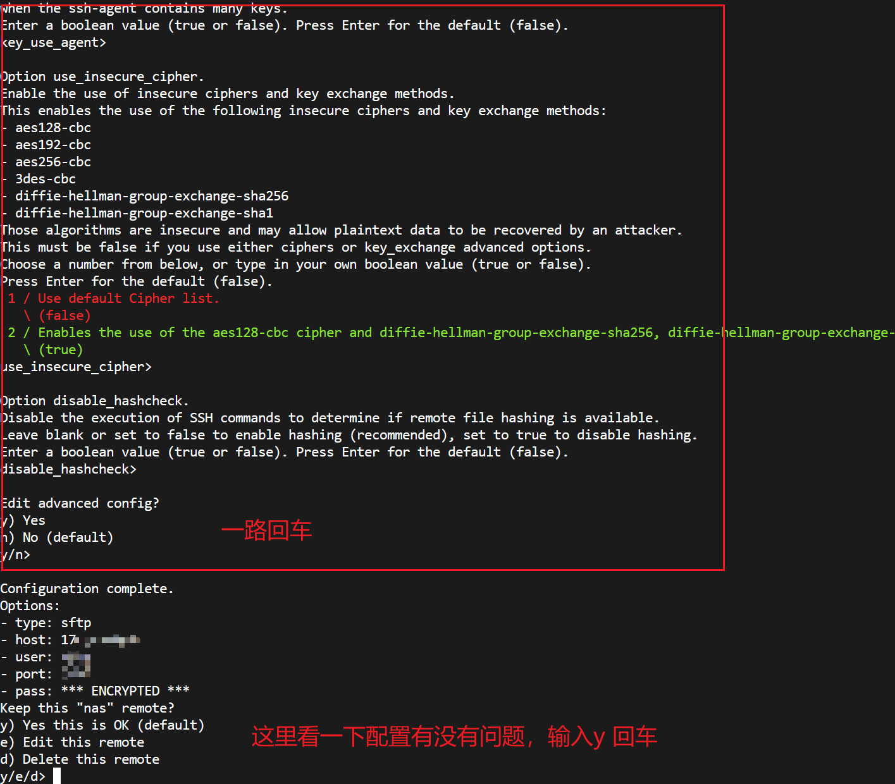

这样就配完了

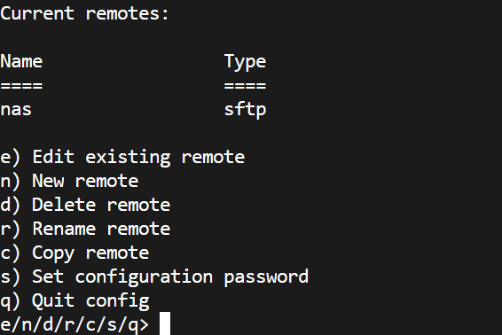


### Google Drive

和之前配置差不多，new 一个 gdrive 配置，选 Google Drive 连接，然后按照提示输入信息。

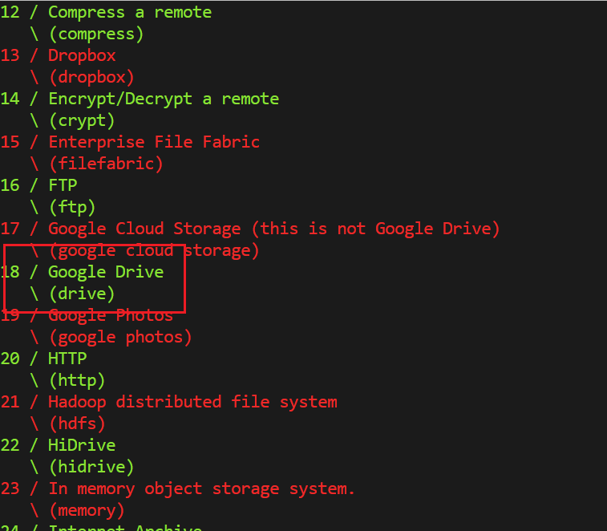

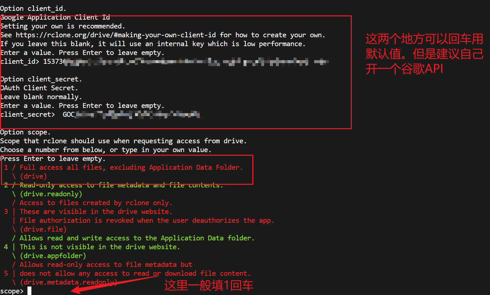

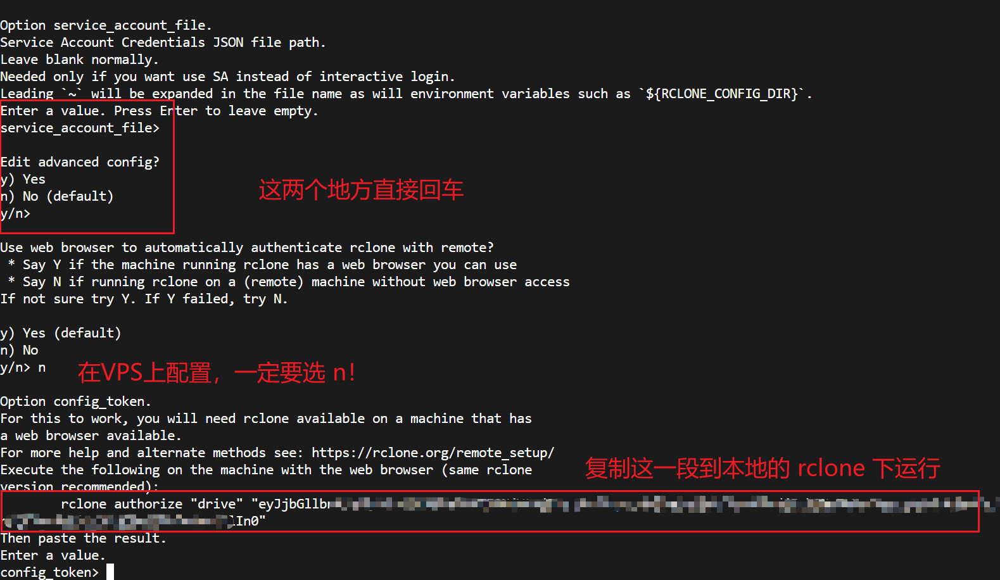

这一步需要 Google 账户授权认证，需要一个浏览器交互环境。在 VPS 上一般是没带浏览器的，所以需要在本地浏览器授权好再上传。

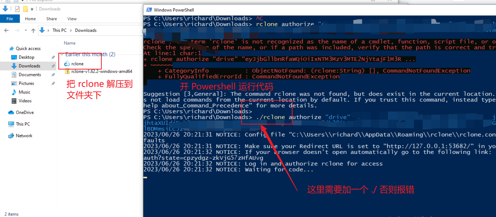

如果是自己配置的 API，大概率会弹警告。不用管他。

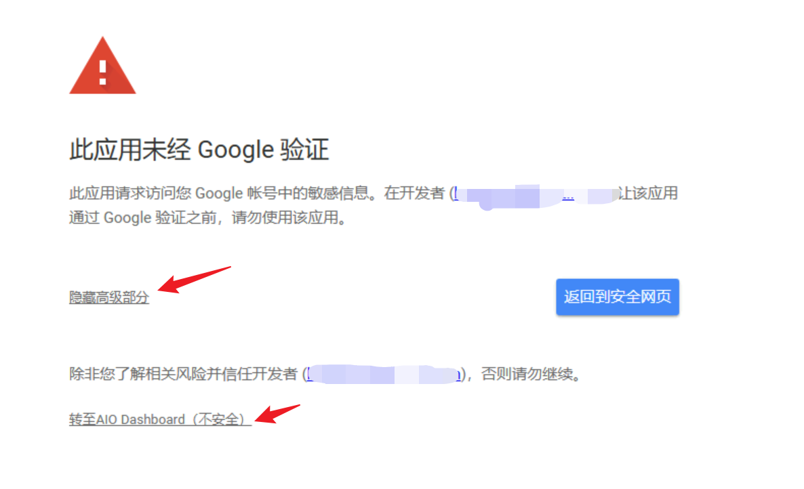

然后一路确定，看到 Success 之后去 Powershell 复制 Token

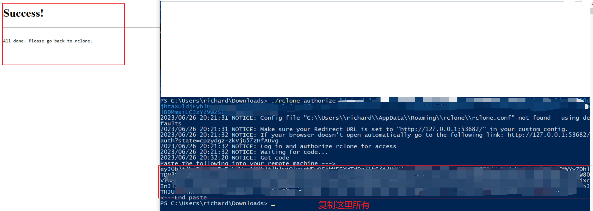

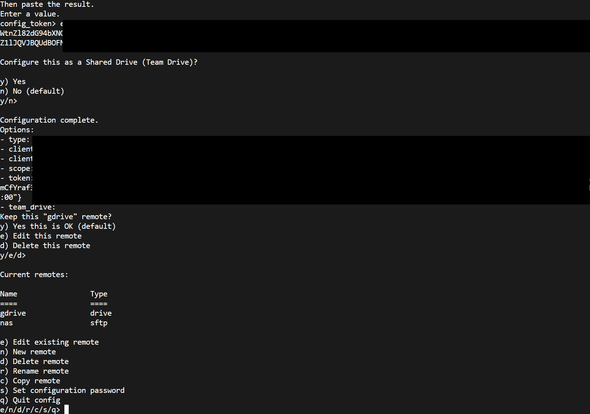


这样就把两个连接都配置完了。接下来就可以直接开始 Copy

<!-- 
### Webdav

 -->


## Use Rclone Copy

在 Copy 之前，先 ls 一下看下连接有没有错误。有输出就OK。

```
rclone ls gdrive:
rclone ls nas:
```

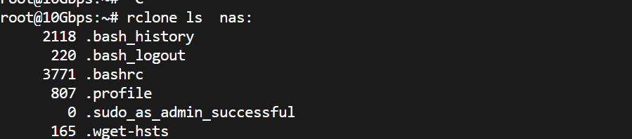


ls 也可以用来查看文件所在的位置。确定好位置之后，就可以开始 Copy 了。Rclone 的 Copy 是自动循环的，并且支持跳过已经 Copy 的部分。另外，建议在 Copy 时开启统计功能 `--stats 1s --progress`。

例如我从 nas 上 `/nas/HDD4T/Animation` 目录复制到 Google Drive `/anime` 目录，开启统计功能的代码如下：

```
rclone copy  nas:/nas/HDD4T/Animation gdrive:/anime --stats 1s --progress
```

跑起来大概是这个样子。家庭带宽上传太小了。。。另外后台跑建议直接开个 Screen。

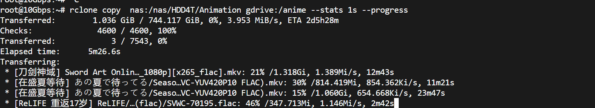


## Conclusion

本文主要介绍了使用 Rclone 将 Nas 上的文件备份到 Google Drive。当然也可以考虑对多个网盘进行相互之间的转移。例如 Google 团队盘和 Onedrive。