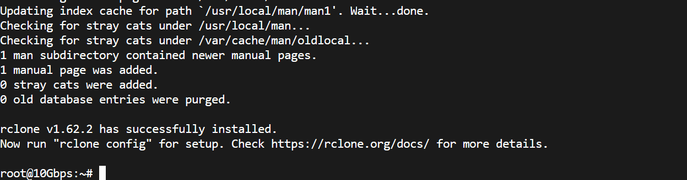
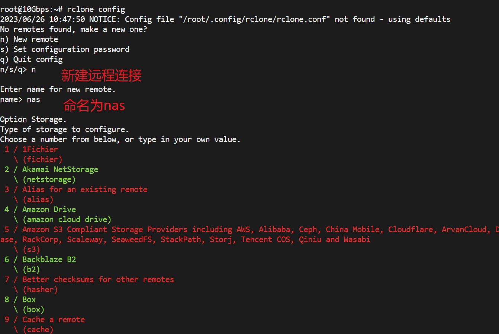
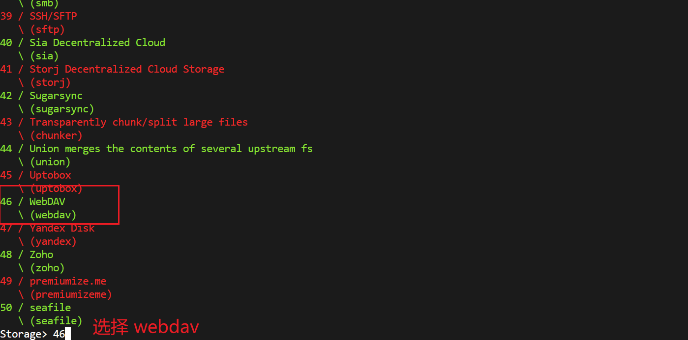

手头有个闲置的谷歌企业版订阅（据称网盘容量无限），家里有个 NAS，最近又入了一台 10Gbps 不限流量 VPS，很自然的想要把 NAS 的东西弄个备份，也方便进行分享。技术上比较好用的就是 Rclone 了。支持的平台也特别多。


## Introduction

Rclone 是一款开源软件，用于管理本地存储、Webdav、S3、以及各种网盘中的文件。提供了复制、同步等功能，以及喜闻乐见的挂载为本地硬盘的功能（当然本文用不到挂载），Rclone 本身是命令行的，但是有开放 API，也有第三方的 GUI。个人推荐还是用命令行，参考 [官方文档](https://rclone.org/)，用起来比较方便。

## Use Rclone

首先安装 Rclone，在 Linux 上一行命令就可以搞定了：

```bash
sudo -v ; curl https://rclone.org/install.sh | sudo bash
```

在 Windows 上的话，得首先去 [下载界面](https://rclone.org/downloads/) 下载 rclone 文件，解压，把里面 rclone.exe 弄出来，然后同目录下 SHIFT+右键，在此处运行 Powershell，然后 `./rclone` 即可。





