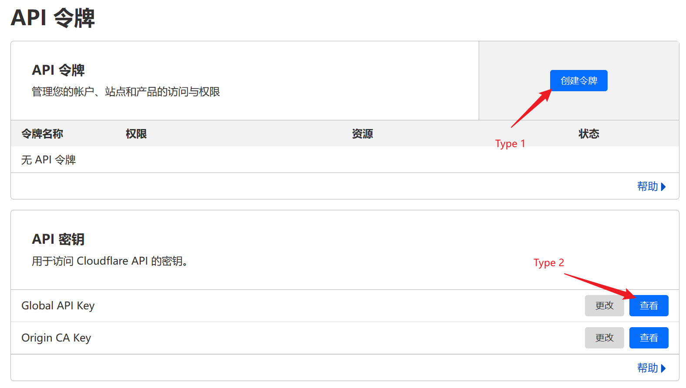

Cloudflare 提供了一个非常方便的 API 接口，正好手头有一些域名闲置，就拿来写一个次级域名分发系统。

## Introduction

Cloudflare 大家都很熟悉了。API 文档在 [这里](https://developers.cloudflare.com/api)。这次主要是用 [Zone](https://developers.cloudflare.com/api/operations/zones-get?schema_url=https%3A%2F%2Fraw.githubusercontent.com%2Fcloudflare%2Fapi-schemas%2Fmain%2Fopenapi.yaml#Request) 和 [DNS](https://developers.cloudflare.com/api/operations/dns-records-for-a-zone-list-dns-records) 两个接口。

稍微注意点的是认证方式。Cloudflare API 有两种认证方式不能混用。打开 [API令牌界面](https://dash.cloudflare.com/profile/api-tokens)，如下图所示：




Type 1：在这个界面选择“创建令牌”，用

```
headers={'Authorization': f'Bearer {cf_key}'}
```

访问。

Type 2：如果是 Global API key，用

```
headers={'X-Auth-Email': cf_email, 'X-Auth-Key': cf_key}
```

访问。


## Development

构建过程其实就是访问 Cloudflare API 并将接口转换暴露给 Flask 的过程。主要实现了 

1. 列出用户拥有的 DNS 记录
2. 检查 DNS 记录是否存在
3. 更新/新建/删除 DNS 记录
4. 列出所有顶级域名 
   
这几个接口。考虑到频繁请求 Cloudflare API 不太好，除 3 必须要请求 API 外，其他逻辑都在本地数据库处理。实际上，1，2，4 的逻辑都比较简单，就是查询而已，增、删、改都在 3。

本次构建使用了 RESTFUL API 的设计方式，使用不同 method 代表不同操作，并聚合在一个接口中。如下所示：

```python
# 新建/更新/删除 DNS 记录
@app.route('/dns/<zone_name>', methods=['POST'])
@app.route('/dns/<zone_name>/<record_name>', methods=['PUT', 'DELETE'])
```

CF API 交互方面，大致思路是查询本地数据库-请求 CF API-更新本地数据这样的流程。API 认证使用了前面提到的第二种方式，即直接使用 Global Token 访问。需要注意的是，在检测是否成功提交时，除了检查返回的`status_code`外，还要检查返回值中`success`是否为`True`。这里我没有将 CF API 的报错直接返给前端（或者说用户），也是考虑到安全性的因素：报错信息中可能包含一些不必要的内容。“更新 DNS 记录” 的示例代码如下。其他几个方法类似。 


```python
# 更新 DNS 记录
data = request.get_json()

# 查询要更新的记录是否存在
existing_record = db['dns'].find_one({'name': record_name, 'user_id': user_id})
if not existing_record:
    return jsonify({'success':False,'error': 'DNS record not found.'})

# 调用 Cloudflare API 更新 DNS 记录
response = requests.put(f'{cf_endpoint}/{zone_id}/dns_records/{existing_record["id"]}', headers={'X-Auth-Email': cf_email, 'X-Auth-Key': cf_key}, json=data)
if response.status_code == 200 and response.json()['success']:
    # 更新 MongoDB 中的 DNS 记录
    db['dns'].update_one({'name': record_name }, {'$set': data})
    return jsonify({ 'success':True,'message': 'DNS record updated successfully.'})
else:
    print(response.json())
    return jsonify({'success':False,'error': 'Failed to update DNS record.'}), response.status_code
```

最后，加上一些认证逻辑就完工了。

## Conclusion

本文实现了次级域名分发系统后端。 Cloudflare API 文档还是比较人性化的，如果需要拿个什么东西练手，其实这个就不错。也可以实现一些其他功能，例如域名批量导入、DNS 批量管理等。