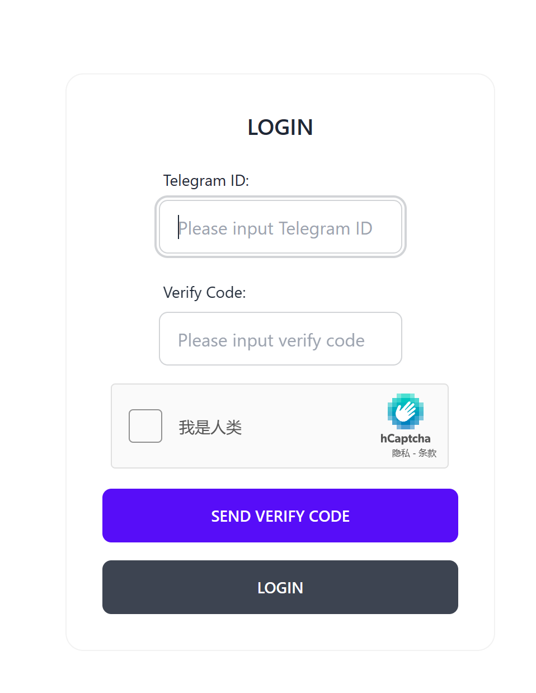

前两篇文章介绍次级域名分发系统的开发，本文来总的介绍一下如何使用 2leve.免费领取次级域名。

## Introduction

次级域名（Subdomain）是在一级域名之下创建的子域名。它是将一级域名进一步划分为更具体的部分。例如 `www.example.com`中，`www`就是一个常见的次级域名，`example.com` 为一级域名，`.com`为顶级域名，或者说域名后缀。

需要注意，在本服务中，`www`，`*`，以及空值都是不允许注册，默认保留的。`*`实际上代表通配符域名，只要某个记录没有解析，就都会被解析到这一记录下。

由于基于 Cloudfalre API 开发，本服务默认支持开启 Cloudflare CDN 加速。

## Usage

访问 [分发系统](https://domains.vpslog.net/)，默认情况下需要进行登录，在弹出的界面下，

