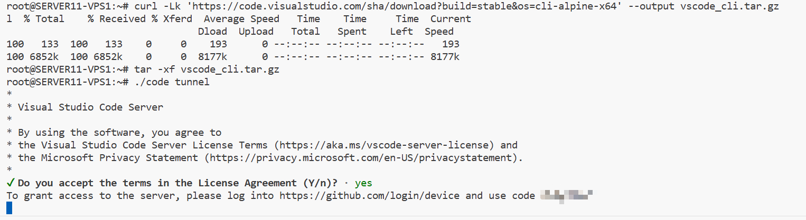
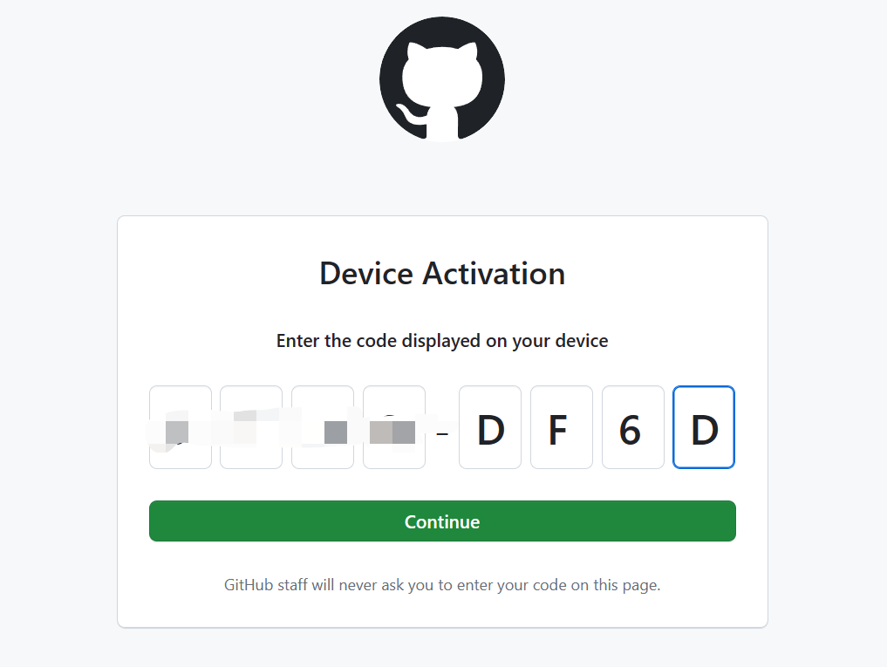
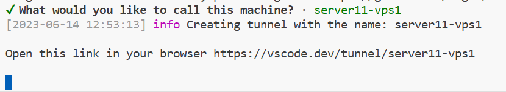
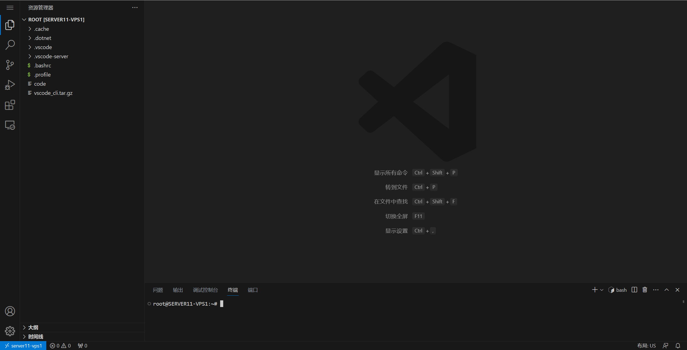

本篇教程基于公益服务器

## Introduction

这一篇和上一篇文章 [使用 Codespace 一键开启云端编程体验](https://vpslog.net/blog/%E4%BD%BF%E7%94%A8-codespace-%E4%B8%80%E9%94%AE%E5%BC%80%E5%90%AF%E4%BA%91%E7%AB%AF%E7%BC%96%E7%A8%8B%E4%BD%93%E9%AA%8C/) 比较类似。上一篇文章主要讲述如何在没有云服务器的情况下获取远程开发环境，这篇文章关注在 VPS/NAS 上进行部署。

VSCode Remote 这个功能很早之前就有了，当时还是 SSH 连接，宿主机需要有公网 IP，且需要用 ssh key，否则每次打开都要输入密码。比较麻烦。之后 VSCode Tunnel 功能出现，真正实现了一键部署远程服务器。

使用 VSCode Tunnel 开启的 VSCode Server 远程开发服务器，**全部绑定在 Github 账户下，之后在任意联网设备上打开 vscode.dev，登录账号，都可以随时进行连接,** 而不需要下载 VSCode 桌面版。

## How to use VSCode Tunnel

登陆服务器，运行以下命令

```sh
curl -Lk 'https://code.visualstudio.com/sha/download?build=stable&os=cli-alpine-x64' --output vscode_cli.tar.gz
tar -xf vscode_cli.tar.gz
./code tunnel
```

不出意外将有以下输出，注意其中被我马赛克的部分，打开 [Github 认证](https://github.com/login/device)，把你的认证代码复制进去。





然后一路确认即可。之后回到服务器，会要你给设备起个名字，随意。起好之后，打开 https://vscode.dev/tunnel/\[名字\] 就可以直接体验 Web 版的 VSCode 了。





关闭命令窗口，VSCode Server 服务器也会关闭，如果需要再次打开，请使用

```sh
./code tunnel
```

