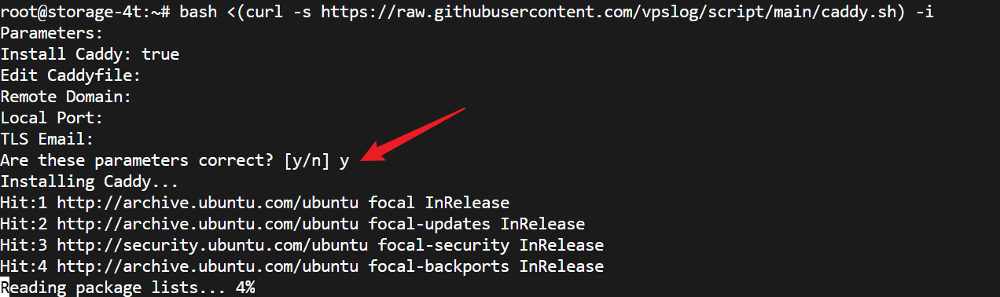
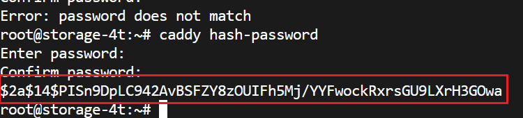
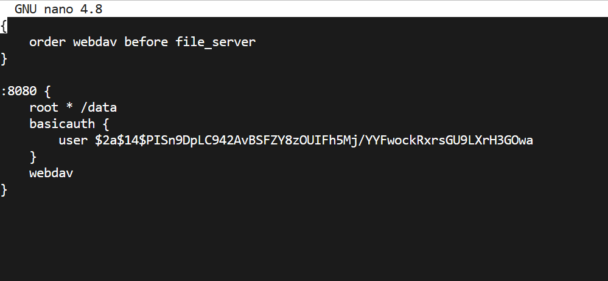
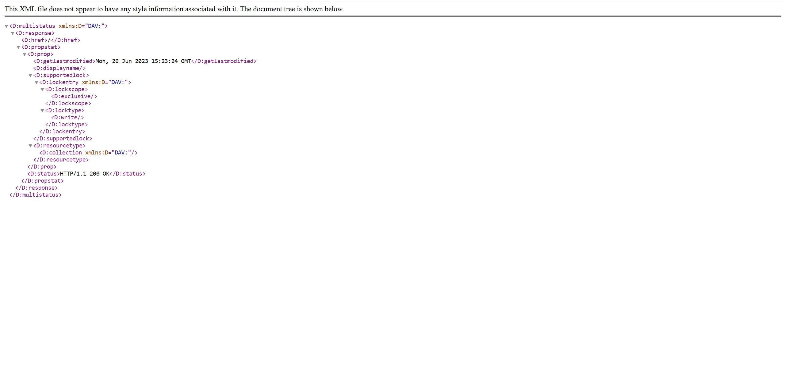
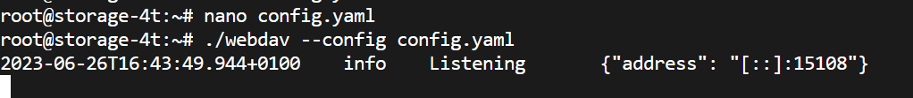

本文主要是介绍两种相对简单 Webdav 部署方法。使用 Caddy-Webdav 和使用 Simple Go WebDAV server

## Introduction

WebDAV是一种基于HTTP/HTTPS协议的扩展，用于在网络上访问和管理文件。它的全称是“Web-based Distributed Authoring and Versioning”，即基于Web的分布式创作和版本控制。

通过WebDAV，用户可以像操作本地文件一样在远程服务器上创建、修改、删除和移动文件，还可以对文件进行锁定和解锁等操作。

相比 SMB 等，虽然SMB通常比WebDAV更快，但 Webdav 跨平台支持性以及配置方面都比较简单。

## Deploy Webdav On Linux

第一种方法 Caddy-Webdav 适合已有 caddy 环境，并且可以访问 GitHub 的用户，否则建议用第二种方法。

### Use Caddy-Webdav

首先安装 Caddy，可以参考[官网](https://caddyserver.com/)，也可以使用以下脚本：

```
bash <(curl -s https://raw.githubusercontent.com/vpslog/script/main/caddy.sh) -i
```

等待安装完成即可。



然后安装 Caddy Webdav 模块，运行以下命令（这一步必须要有 Github 访问）

```
sudo caddy add-package github.com/mholt/caddy-webdav
sudo systemctl restart caddy
```

编辑 `/etc/caddy/Caddyfile`，在文件最开始加上

```
{
    order webdav before file_server
}
```


然后在后面网站配置里加上 `webdav` 栏即可。

```
:8080 {
    root * /data
    webdav
}
```

上面这个配置会在 8080 端口跑一个 webdav， 打开后就可以访问 `/data`（可以先把这个目录创建好 `mkdir /data`，加个测试文件，否则之后会 404），但是这个配置的问题在于没有权限验证，网络中所有用户均可以访问，建议是加一个鉴权。首先用

```
caddy hash-password
```

交互式生成一个密码：输入两遍，然后复制生成的这段加密后的密码



在上面配置文件中加一个鉴权：

```
:8080 {
    root * /data
    basicauth {
        user $2a$14$PISn9DpLC942AvBSFZY8zOUIFh5Mj/YYFwockRxrsGU9LXrH3GOwa
    }
    webdav
}
```

这里配置了用户 user 密码是之前设置的密码。全部写入 `/etc/caddy/Caddyfile`，然后 `sudo systemctl restart caddy` 重启 caddy 即可。

配置文件大概长这样，如果重启报错看看配置文件是不是写错了。



打开 IP:8080，登录。如无意外，应该有以下输出：



即表示配置成功

### Use Simple Go WebDAV server

这是一个 Github [项目](https://github.com/hacdias/webdav)。但是已经不更新了。另外要吐槽一句这个项目名称居然直接就是 webdav，可以说没有任何 SEO。导致你几乎不可能找到一些相关的博客或者文章或者文档。只能参考那个简陋的 Readme。好在要配置的东西也不是特别多。


首先去找一下[系统对应的程序](https://github.com/hacdias/webdav/releases/tag/v4.2.0)，Linux 下，可以直接

```
# 下载安装包
curl -L -O https://github.com/hacdias/webdav/releases/download/v4.2.0/linux-amd64-webdav.tar.gz

# 解压缩安装包
tar -zxvf linux-amd64-webdav.tar.gz
```

然后编辑一个配置文件 `config.yaml`，写入以下内容

```
address: 0.0.0.0  # 指定WebDAV服务监听的网络地址。0.0.0.0表示监听所有可用的网络接口。
port: 15108  # 指定WebDAV服务监听的端口号。可以改。
auth: true  # 开启基本身份验证（Basic Auth）功能，需要在后续的users字段中为每个用户设置用户名和密码。
tls: false  # 禁用TLS/SSL加密。
scope: .  # 默认作用域。指定所有用户都有权限访问的根目录，默认为`.`，即当前目录。
modify: true  # 是否允许用户修改文件。默认为true，即允许用户修改文件。
rules: []  # 规则列表。可以定义一些规则来限制用户对某些目录或文件的访问权限，例如只读等。
users:  # 用户列表。
  - username: user # 用户名。
    password: 123 # 密码。
    scope: /data  # 作用域。该示例中，该用户只能访问位于/data目录下的文件。
```

注意改一下最后的三个参数。保存修改，运行 `./webdav --config config.yaml` 即可。应该有如下输出。 webdav 跑在 IP:15108 上。后台运行可以用 Screen。




这样其实就可以了。不过每次启动服务器都要重新运行一下命令。比较麻烦。所以干脆写个系统进程。

首先编辑 `/etc/systemd/system/webdav.service`

写入以下内容：

```
[Unit]
Description=WebDAV server
After=network.target

[Service]
User=root
Group=root
Type=simple
ExecStart=/full/path/to/webdav --config /full/path/to/config.yaml
Restart=always

[Install]
WantedBy=multi-user.target
```

其中，`/full/path/to/` 需要替换为实际的路径（如果你保持默认的话，应该是 `ExecStart=/root/webdav --config /root/config.yaml
`。该服务将以root用户和root组的身份运行，并在网络启动之后启动。


运行以下命令启用并启动 systemd 服务

```bash
sudo systemctl enable webdav.service && sudo systemctl start webdav.service
``` 

这将立即启动WebDAV服务，并将服务添加到系统启动列表中，使得系统启动时自动启动WebDAV服务。

使用
```bash
sudo journalctl -u webdav.service -f
```

查看详细运行状况。如果出现 `Permission Deny`，请使用 `setenforce 0` 后再启动 `webdav`（具体参考 [本文](https://blog.csdn.net/weixin_42915431/article/details/106533610)）

## Conclusion 

本文介绍了 Caddy-Webdav 和 Simple Go WebDAV server 两种配置 Webdav 的方法。第二种方法适用范围更广，但是需要手动开启自启动。除了这两种方法以外， Apache 等 Http server 也可以配置 Webdav。